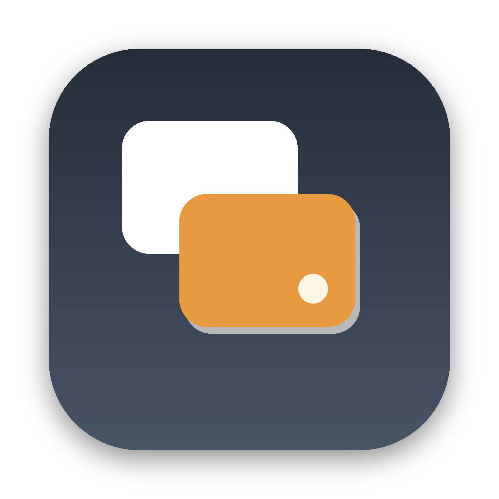
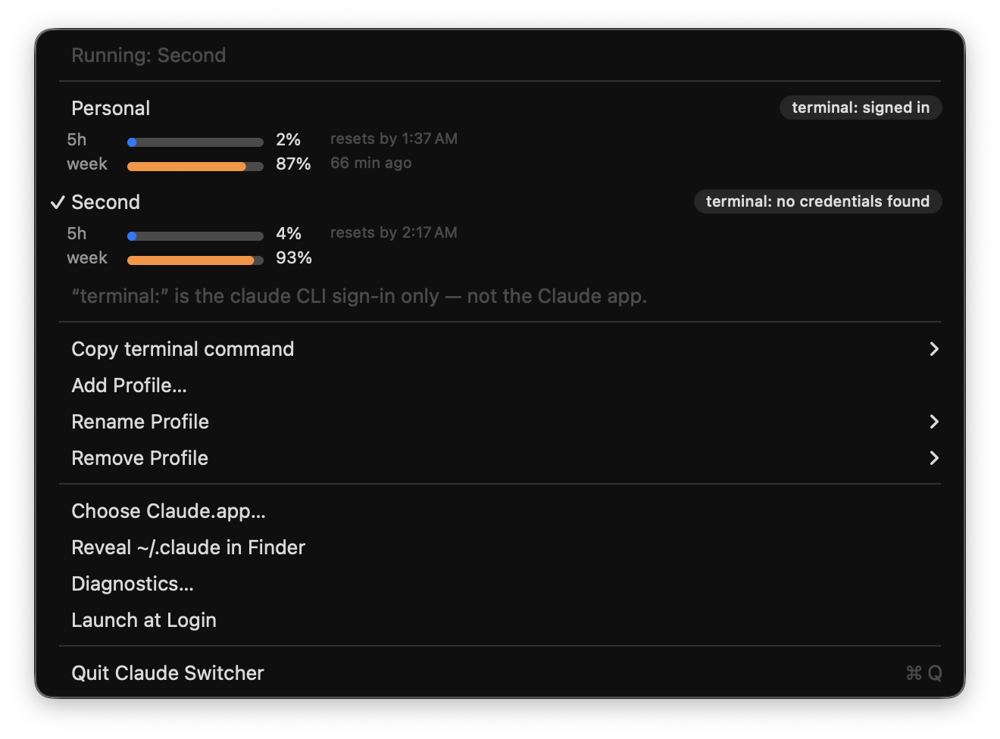

<div align="center">



# Claude Switcher

**Several Anthropic accounts on one Mac — and one shared `~/.claude`.**

[](https://github.com/kevinchau/claude-switcher/actions/workflows/ci.yml)
[](https://github.com/kevinchau/claude-switcher/releases/latest)


### [⬇︎ Download for macOS](https://github.com/kevinchau/claude-switcher/releases/latest/download/Claude.Switcher.dmg)

</div>

When one account hits its usage limit, the day stops. The usual workaround — a second config directory — gets you a second account by throwing away everything that made the first one useful.

Claude Switcher is a menu-bar app that runs multiple Anthropic accounts side by side on one Mac, in Claude Desktop (chat **and** the Code tab) and in the terminal `claude` CLI. Every account shares **one `~/.claude`**, so your memories, skills, subagents, plugins, settings and project/session history follow you to all of them. Hitting a limit costs you a menu click, not your context.

<p align="center">
  
</p>

---

## Why this exists

Burn through your Fable quota and the rest of the week turns into pulling hairs: same questions, a lot more coaxing. A second account puts you back on Fable in one click.

<p align="center">
  
</p>

The advice you will find online is to point `CLAUDE_CONFIG_DIR` at a second directory per account:

```sh
alias claude-work='CLAUDE_CONFIG_DIR=~/.claude-work claude'   # not what this tool does
```

Per [`RR()`](#21-the-config-dir-is-independent-of-the-electron-profile), that works — and it isolates **exactly the things you want to keep**: `projects/` (your session history), `history.jsonl`, `skills/`, `agents/`, `plugins/`, your memory and `CLAUDE.md`, `settings.json`, your MCP server config and your permission grants. Your second account starts as a stranger: no memory of your projects, none of your skills, none of your subagents, none of your tool permissions.

`claude-switcher` separates accounts along a different axis. The Electron profile (`--user-data-dir`) carries the *identity*; the Keychain slot (`CLAUDE_SECURESTORAGE_CONFIG_DIR`) carries the *terminal credential*; and `~/.claude` — everything you actually built up — stays shared across all of them. **Which is why this tool never sets `CLAUDE_CONFIG_DIR`, and why doing so would defeat its entire purpose.**

---

## What it looks like

The whole interface is one menu — here with two accounts running at once:

<p align="center">
  
</p>

Its structure as text, read from the running app's accessibility tree — one row per
account, a checkmark on the ones currently up:

```
Running: Personal
──────────────────────────────
✓ Personal            terminal: signed in
  Work                terminal: no credentials found
  Open Source         terminal: no credentials found
"terminal:" is the claude CLI sign-in only — not the Claude app.
──────────────────────────────
Copy terminal command            ▸
Add Profile…
Rename Profile                   ▸
Remove Profile                   ▸
──────────────────────────────
Choose Claude.app…
Reveal ~/.claude in Finder
Diagnostics…
Launch at Login
──────────────────────────────
Quit Claude Switcher
```

When Claude has downloaded an update it cannot install — see [§2.9](#29-updates-need-every-instance-to-quit) — two more lines appear under the header:

```
Running: Personal, Work
Claude 2.110.1 is downloaded but can't install until every profile quits.
Quit All & Install Update…
```

And `claude-switcher --dry-run`, which prints the resolved launch plan and exits without launching or creating anything. Verbatim output from a run with Claude up on the default profile and a second profile `Work` configured, with only the home directory rewritten to `/Users/me` (and the Keychain suffix recomputed to match, since it is `sha256` of that exact string — see [§2.7](#27-keychain-service-name-derivation)):

```
claude-switcher launch plan (dry run — nothing was launched or created)

Config file:  /Users/me/.config/claude-switcher/config.json
Claude.app:   /Applications/Claude.app
Shared dir:   /Users/me/.claude (shared by every profile; CLAUDE_CONFIG_DIR is never set by this app)
Active profile: default

Profile "Personal" (id: default)  [default profile]
  user data dir:   (none — the app's own default profile)
  would create it: no
  argv:            (no arguments)
  new instance:    no (an instance for this profile is already running)
  environment:     (inherited — no CLAUDE_* variables are ever injected)
  already running: yes (pid 4953) — would activate it instead of launching
  keychain item:   Claude Code-credentials  (terminal CLI only; existence check only — the secret is never read)
  terminal cmd:    claude

Profile "Work" (id: work)
  user data dir:   /Users/me/Library/Application Support/Claude-work
  would create it: yes (mkdir -p at launch time)
  argv:            "--user-data-dir=/Users/me/Library/Application Support/Claude-work"
  new instance:    yes (createsNewApplicationInstance — never focuses another profile's window)
  environment:     (inherited — no CLAUDE_* variables are ever injected)
  already running: no — would launch
  keychain item:   Claude Code-credentials-1082021d  (terminal CLI only; existence check only — the secret is never read)
  terminal cmd:    CLAUDE_SECURESTORAGE_CONFIG_DIR="/Users/me/.claude-accounts/work" claude
```

If any running instance matches no configured profile, a trailing `Running instances matching no profile:` block lists it by pid. A config that cannot be read is reported on stderr and exits `1`.

---

## Install

### Download the app

**[⬇︎ Claude Switcher.dmg](https://github.com/kevinchau/claude-switcher/releases/latest/download/Claude.Switcher.dmg)** — open it and drag Claude Switcher to Applications.

Signed and notarized, so it just opens. Needs macOS 14+ and Claude Desktop.

### Or build it from source

```sh
git clone https://github.com/kevinchau/claude-switcher.git
cd claude-switcher
make install
```

`make install` builds the release binary, assembles `build/Claude Switcher.app`, signs it, and copies it to `/Applications`. That is the only thing the build system touches outside the working tree — it never modifies the `Claude.app` bundle, and it never writes `~/.config/claude-switcher/config.json` (only the running app does that). Launch at Login is *not* enabled by installing; it is a menu-bar toggle.

A source build is signed with your own Developer ID certificate if you have one, and **ad-hoc** otherwise — an ad-hoc app runs only on the machine that built it, which is fine when that machine is yours. See [Signing and distribution](#signing-and-distribution).

| | |
| --- | --- |
| Toolchain | Swift 6 (Xcode 16+); developed against Swift 6.3.3 |
| Dependencies | None. AppKit and Foundation only, no Xcode project. |

---

## Usage

### Desktop

Each profile in the config is one Anthropic account.

1. Open the menu-bar item and choose **Add Profile…**. Give it a label (e.g. `Work`). The tool derives a slug id — **lowercased**, non-alphanumerics collapsed to `-` — and assigns `userDataDir = ~/Library/Application Support/Claude-<slug>` and `credDir = ~/.claude-accounts/<slug>`. Adding it **launches it immediately**: `addProfile` calls the same launch path the menu rows use, so `Claude.app` comes up right away as a second, concurrent instance with a fresh Electron profile and you land on its sign-in screen. There is no second step of finding the new profile in the menu. (The alert says so before you confirm.)
2. **Sign in once, interactively, in that window.** The tool never touches credentials — you log in yourself, exactly as you would on a new Mac.
3. From then on, picking that profile focuses the existing instance if it is running, or launches it if it is not. The default profile is launched with no `--user-data-dir` argument, which selects the app's own profile directory — but it is still launched as a *new* instance whenever no instance matching it is running (see [§2.8](#28-what-the-tool-actually-does-with-all-this)).

Both accounts stay up at the same time — no quitting, no logging out, no waiting — and there is nothing special about the number two: add as many profiles as you have accounts. Every instance sees the same `~/.claude`, so the same projects, history, skills, agents, plugins and settings are there on all of them.

### Terminal

The Desktop account is chosen by `--user-data-dir`; the **terminal CLI** account is chosen by `CLAUDE_SECURESTORAGE_CONFIG_DIR` (see [§2.6](#26-the-terminal-cli-is-a-separate-story)). **Copy terminal command** puts the right invocation on the pasteboard:

```sh
# default profile — the variable is OMITTED, never set to ""
claude

# any other profile
CLAUDE_SECURESTORAGE_CONFIG_DIR="/Users/me/.claude-accounts/work" claude
```

The first run for a new credential dir will be logged out; sign in interactively, once. `~/.claude` is shared either way, so your history, skills and memory come along.

<details>
<summary><b>Every menu item, in detail</b></summary>

The menu is rebuilt on every open so running state is fresh.

- A disabled header: `Running: Personal, Work` — or `Claude is not running`.
- **Quit All & Install Update…**, under a disabled line naming the version — shown only while Claude has an update downloaded, its installer is alive and waiting, and at least one instance is running (see [§2.9](#29-updates-need-every-instance-to-quit)). It confirms first, naming the profiles it will quit and reopen and any unrecognized instances it will quit and *not* reopen. It then asks every instance to quit (the same as ⌘Q — never forced), waits for Claude's own installer to finish, and reopens the profiles that were running; if an instance will not quit, nothing is reopened and it says which profiles are closed. While it runs, a progress line replaces the offer. **This is the only thing in the app that ever quits Claude, and it never happens on its own.**
- One item per profile: the label, a checkmark when an instance for that profile is running, and a badge hint about the terminal CLI. The hint has **three** states, from `MenuBuilder.hintText`:

  | probe result | hint |
  | --- | --- |
  | a credential item exists | `terminal: signed in` |
  | no credential item | `terminal: no credentials found` |
  | not probed yet | `terminal: unknown` |

  `terminal: unknown` is what you see before the background Keychain probe reports — the menu is built from a cached snapshot and never blocks on a `security` call, so a first open can show it briefly; the hints are then patched in place rather than rebuilding the menu under the cursor. Note that the probe reports **failure the same as genuine absence**: `KeychainProbe.isSignedIn` returns `false` on any thrown error, timeout or non-zero exit, so `terminal: no credentials found` means "no credential item was found", not necessarily "you are not signed in". **The hint describes the terminal CLI only** — the Desktop login is separate and is not something the tool can inspect.
- **Copy terminal command** — one item per profile (see [Terminal](#terminal) above).
- **Add Profile…**, **Rename Profile** (one item per profile; changes only the label shown in the menu — the id, both directories and therefore the Keychain service name stay exactly as they are), and **Remove Profile** (disabled for the default profile and for the active profile; confirms first; **never deletes the profile's data directories**, and says so in the dialog).
- **Choose Claude.app…** — an `NSOpenPanel`, offered when the configured path is missing or on request.
- **Reveal ~/.claude in Finder**.
- **Diagnostics** — a selectable-text alert with: the config path; the resolved `Claude.app` path, its `CFBundleIdentifier` and version, any staged update and whether Claude's installer is running; the shared config dir (`~/.claude`) and confirmation that `CLAUDE_CONFIG_DIR` is unset; each profile with its normalized directories, derived Keychain service name and running pid; and the `claude` CLI version for both the `PATH` binary and the app-managed sidecar if present.
- **Launch at Login** — a checkbox bound to `SMAppService.mainApp`, reflecting `.status`. A bundle that has never been registered reports `.notFound`, which is *not* an error: it is shown as an unchecked box and clicking it registers. The item is greyed out only when the process is not inside an `.app` bundle (`swift run`), where there is nothing launchd could register.
- **Quit**.

Launches are serialized, but only the items that could start a second one are gated on the in-flight flag: **the profile rows, Add Profile…, the Rename Profile submenu and the Remove Profile submenu** go disabled while a launch is in flight and re-enable on completion (a 30-second watchdog re-enables them if a completion handler never arrives). **Copy terminal command, Choose Claude.app…, Reveal ~/.claude, Diagnostics…, Launch at Login and Quit stay enabled throughout.** The profile rows additionally require the configured `Claude.app` to exist.

An update install holds the same flag from confirmation until the last profile is back, and additionally disables **Choose Claude.app…** and **Quit** — quitting the switcher mid-install would leave every profile closed with nothing to reopen it.

</details>

---

## What's shared, what's per-account

| State | Location | Shared or per-account |
| --- | --- | --- |
| Project + session transcripts | `~/.claude/projects/` | **Shared** across every account |
| Prompt history | `~/.claude/history.jsonl` | **Shared** |
| Skills | `~/.claude/skills/` | **Shared** |
| Subagents | `~/.claude/agents/` | **Shared** |
| Plugins | `~/.claude/plugins/` | **Shared** |
| Memory and `CLAUDE.md` | `~/.claude/` | **Shared** |
| Settings (incl. MCP servers, permissions) | `~/.claude/settings.json` | **Shared** |
| Code tab project + session list | enumerated from `~/.claude/projects/`, unfiltered | **Shared** |
| Desktop app login / identity | Electron profile (`--user-data-dir`) | Per-account |
| Cookies, Local Storage, IndexedDB | Electron profile | Per-account |
| Desktop MCP config | `claude_desktop_config.json` in the Electron profile | Per-account |
| Chat history | server-side, on the Anthropic account | Per-account (cannot be shared) |
| Cowork / remote sessions | server-side | Per-account |
| Usage limits and plan | server-side | Per-account |
| Terminal CLI credentials | Keychain item, service name from [§2.7](#27-keychain-service-name-derivation) | Per-account (per `credDir`) |

---

## How it works

Everything below was established empirically, by reading the shipped `Claude.app` JavaScript and by running live tests. It is *not* how the app is documented to behave — see [Caveats and limitations](#caveats-and-limitations).

### 2.1 The config dir is independent of the Electron profile

The app resolves its Claude config directory with exactly this function (from the shipped bundle, names minified):

```js
function RR(){ let e = process.env.CLAUDE_CONFIG_DIR; return e ? zw(e) : join(homedir(), ".claude") }
```

That is: `CLAUDE_CONFIG_DIR ?? ~/.claude`. It has **no relationship to `--user-data-dir`**. So you can give the app a completely separate Electron profile — a separate login, a separate account — and it will still read and write the same `~/.claude`.

This is the mechanism the whole tool is built on. **`claude-switcher` therefore never sets or modifies `CLAUDE_CONFIG_DIR`, anywhere.** Setting it would isolate exactly the state we are trying to share.

### 2.2 `--user-data-dir` gives you a separate account

`Claude.app` is an Electron app, and `--user-data-dir=<dir>` is Electron's own flag for choosing the profile directory. Passing it produces a fresh Electron profile: launching with a new directory populates it with `Local Storage/`, `Cookies`, `IndexedDB/` and `claude_desktop_config.json`, and the app comes up logged out. Signing in there creates a second, independent app login — **for both the chat side and the Code tab** — while `~/.claude` ([§2.1](#21-the-config-dir-is-independent-of-the-electron-profile)) remains shared.

### 2.3 Instances run concurrently

There is **no `requestSingleInstanceLock` anywhere in the app**. Multiple instances with different `--user-data-dir` values run side by side. Switching accounts is therefore *launching or focusing another instance* — there is no quitting, no logging out, no waiting. (Running side by side has one cost, and it is the only time anything needs to quit: Claude's updater — [§2.9](#29-updates-need-every-instance-to-quit).)

### 2.4 The Code tab does not read the Keychain

The Code tab's credentials do not come from the macOS Keychain. The app injects `CLAUDE_CODE_OAUTH_TOKEN` directly into the environment of the `claude-code` sidecar process it spawns. Two consequences:

- Setting `CLAUDE_SECURESTORAGE_CONFIG_DIR` on `Claude.app` has **no effect on the Code tab**. The Desktop account — chat and Code tab alike — is selected *purely* by `--user-data-dir`.
- `claude-switcher` never sets `CLAUDE_CODE_OAUTH_TOKEN` and never puts any `CLAUDE_*` variable into a launched app's environment.

### 2.5 Code-tab session history is account-agnostic

Local session enumeration for the Code tab reads `join(configDir, "projects")` with **no account filter**. Combined with [§2.1](#21-the-config-dir-is-independent-of-the-electron-profile), every instance sees the same project list and the same session history.

### 2.6 The terminal CLI is a separate story

For the **terminal `claude` CLI only**, `CLAUDE_SECURESTORAGE_CONFIG_DIR=<dir>` selects a separate credential slot while still sharing `~/.claude`. Verified with `claude auth status`: logged in by default, `loggedIn: false` with the variable pointed at a fresh directory.

The variable must be **omitted entirely** for the default account. Never pass it as an empty string — the CLI branches on whether the variable is *defined*, not on whether it has a useful value.

### 2.7 Keychain service-name derivation

The CLI derives its Keychain service name like this (again from the shipped binary):

```js
oG(e = ""){
  t = env.CLAUDE_SECURESTORAGE_CONFIG_DIR;
  r = t !== undefined ? !t : !env.CLAUDE_CONFIG_DIR;
  n = t !== undefined ? NFC(t) : configDir();
  o = r ? "" : "-" + sha256(n).hex.slice(0, 8);
  return "Claude Code" + OAUTH_FILE_SUFFIX + e + o;
}
```

`OAUTH_FILE_SUFFIX` is `""` in production and `e` is `"-credentials"`, so:

| credential dir | Keychain service name |
| --- | --- |
| not set (`nil`) | `Claude Code-credentials` |
| set to `<dir>` | `Claude Code-credentials-` + first 8 **lowercase** hex chars of `sha256(NFC(<dir>))` |

The hash covers **exactly the string handed to the CLI**, so `claude-switcher` normalizes the path first and hashes the normalized result — the same string it would export.

> **Trap:** pointing a profile's credential dir at `~/.claude` *itself* still yields a hashed service name, not the default one, because the branch keys off whether the variable is defined, not off its value.

### 2.8 What the tool actually does with all this

- **Desktop:** launch `Claude.app` via `NSWorkspace.shared.openApplication(at:configuration:)`. `arguments = ["--user-data-dir=<normalized dir>"]` is set **only** when the profile has a `userDataDir`; the default profile passes **no** arguments, because omitting the flag is exactly what selects the app's own profile directory. It never shells out to `/usr/bin/open`, and never modifies or duplicates the `Claude.app` bundle.
- **`createsNewApplicationInstance = true` is set unconditionally.** Not "only for named profiles" — the launch path is reached *only after* establishing that no running instance matches the requested profile, and at that point a new process is always what is wanted, the default profile included. This must not be made conditional on `userDataDir != nil`. With the flag `false`, `openApplication` activates **any** running instance of the bundle; it has no idea that instance belongs to a different Electron profile. Choosing the default profile while only a named profile was running would then bring the **wrong account's** window to the front, return that instance's pid, and have the tool record the switch as a success. That was a real, high-severity defect. Leave it unconditional.
- **Matching running instances to profiles is three-valued.** Each process's `argv` is read via `sysctl(KERN_PROCARGS2)` (so paths containing spaces parse correctly, and both the `--user-data-dir=VALUE` and `--user-data-dir VALUE` spellings are accepted) and classified into an `InstanceProfile`:
  - `.defaultProfile` — no `--user-data-dir` argument (or an empty value). This *is* the default account.
  - `.directory(String)` — launched with `--user-data-dir=<dir>`, normalized. Matches the profile whose normalized `userDataDir` is equal.
  - `.unknown` — the argument vector could not be read at all. **Matches no profile, ever.**

  The third case is the point: "no `--user-data-dir`" and "we could not read the command line" are entirely different claims. The first identifies the default account; the second identifies *nothing*. Folding them together (`ProcessArgs.arguments(forPID:)` returning `[]` instead of `nil`, say) would make every process the tool lacks permission to inspect masquerade as the user's default account — showing the wrong profile as running, and letting a "focus" action raise an unrelated window while the UI reported success.
- **Launching when unreadable instances exist asks first.** If any running instance is `.unknown`, the tool cannot prove it is *not* the profile you just picked, and starting a second Electron process against one user-data dir puts two Chromium processes on one LevelDB store. Rather than refuse, it presents a confirmation alert naming how many processes did not report a command line, offering **Start Anyway** / **Cancel**.
- If a profile's instance is already running, the tool activates it instead of launching a second copy. Activation re-checks the target process's bundle identifier first, because the menu acts on a snapshot and a pid can be reused between opening the menu and clicking.
- **Bundle identifier:** read `CFBundleIdentifier` from the configured app's `Info.plist`. Never hardcoded.
- **Terminal:** the tool does not run the CLI for you. It copies the right command to the pasteboard and reports sign-in state.
- **Credentials:** the tool performs **existence checks only**, via `security find-generic-password -s "<service>" -a "$USER"`. It never passes `-w`, and never reads, writes, copies, migrates or deletes a Keychain secret. Any failure degrades silently to the same answer as a genuine absence (see the hint table under [Usage](#usage)).

### 2.9 Updates need every instance to quit

Claude Desktop updates itself with Squirrel. When an update has downloaded, the app starts a helper, `ShipIt`, that notes every instance of the app running at that moment, waits until **all of them** have exited, and only then swaps the bundle. (Each running instance re-requests the install at its hourly update check, which restarts the helper with a fresh list.) Claude also updates "stealthily": after an idle timeout it quits itself (`beforeQuitForUpdate … going down for update` in `~/Library/Logs/Claude/main.log`), expecting the helper to install and bring it back.

With one instance that works — observed end to end in about seven seconds. With two it cannot: the other profile never exits, so the helper never starts installing, and **the profile that quit itself stays closed**. Reopening it by hand only restarts the cycle — it re-requests the install and quits again the next time it goes idle. The tell-tale is `~/Library/Caches/<bundle id>.ShipIt/ShipIt_stderr.log` filling with `Detected this as an install request` lines that are never followed by `Beginning installation`.

The switcher cannot change how Claude's updater works, so it does the two things it can:

- **It notices.** On every menu open it reads the helper's request file (`ShipItState.plist` — JSON, despite the name), the `Info.plist` of the downloaded bundle it points at and of the installed app, and scans process names for a live `ShipIt` whose job label is `<bundle id>.ShipIt`. An update counts as blocked only when the request names the configured app, the downloaded bundle still exists inside the helper's cache directory with a different version, *and* a helper is alive to install it — the request file outlives the install it describes, so its presence alone means nothing. Versions are read straight from the plist file, never through `Bundle`, which caches per path and would not notice the app being replaced.
- **It offers the way through: Quit All & Install Update….** After you confirm, it asks each running instance to quit with `NSRunningApplication.terminate()` (the same request as ⌘Q), waits until none is left, waits for the helper to exit, and then reopens the profiles that were running — named profiles first, the default profile last, skipping any that are already back, because the helper sometimes reopens the default profile itself.

The sequence is deliberately timid:

- It quits only the instances that were running when you confirmed, and quits nothing if that set has changed.
- It never escalates: no `forceTerminate()`, no signals. An instance showing a dialog of its own just runs out the one-minute clock — and then **nothing is reopened**. The helper only waits for the instances it listed when it started, so it may begin the moment the last of *those* quits; a profile reopened now could be running from a bundle that is about to be moved away. The alert names the profiles left closed.
- It launches nothing until the helper has *stayed* gone for three seconds. One absent poll proves nothing: a failed install attempt exits and launchd restarts the helper within about two seconds, and the restarted one installs immediately. If the helper is still going after three minutes it reopens nothing and says so. The single exception: once the new version is on disk, only the helper's own relaunch step remains, so after a 15-second grace the profiles are reopened even if it lingers.
- It will not start a profile while an instance it cannot identify is running, since that could be the very profile it is about to start — two processes on one profile directory can corrupt that login.

Everything here is read-only apart from the quit request itself: nothing under the helper's cache directory is written, moved or deleted, the helper is never started by this tool, and the `Claude.app` bundle is only ever replaced by Claude's own installer.

---

## Signing and distribution

`make bundle` resolves a signing identity in this order: `$CODESIGN_IDENTITY` if set, otherwise the first **Developer ID Application** identity in the keychain, otherwise **ad-hoc** (`codesign --sign -`).

**An ad-hoc build runs only on the machine that built it.** On any other Mac, Gatekeeper rejects it — "unidentified developer" / "damaged". This is not theoretical: `spctl -a -t exec` reports `rejected` for an ad-hoc bundle, and `source=Unnotarized Developer ID` for one that is signed but not yet notarized. Only a notarized, stapled build reports:

```
Claude Switcher.app: accepted
source=Notarized Developer ID
origin=Developer ID Application: …
```

To ship a build to other people you need an Apple Developer Program membership and a Developer ID Application certificate, then:

```sh
CODESIGN_IDENTITY="Developer ID Application: Your Name (TEAMID)" make bundle
make notarize
```

`make notarize` (`scripts/notarize.sh`) needs notarytool credentials. Store a profile once:

```sh
xcrun notarytool store-credentials claude-switcher \
    --apple-id you@example.com --team-id TEAMID \
    --password <app-specific-password>
```

and run with `NOTARY_PROFILE=claude-switcher` (the default), or pass `APPLE_ID` / `TEAM_ID` / `APP_PASSWORD` in the environment.

Preferred, and how the releases here are built — an **App Store Connect API key**, which needs no app-specific password, so no secret is typed or pasted anywhere:

```bash
ASC_KEY_PATH=~/.appstoreconnect/private_keys/AuthKey_XXXXXXXXXX.p8 \
ASC_KEY_ID=XXXXXXXXXX \
ASC_ISSUER_ID=<issuer-uuid> \
make notarize
```

The script zips the app with `ditto --keepParent`, submits it and waits, staples the ticket, validates it, re-zips the stapled app, and prints a final Gatekeeper assessment. It refuses up front if the bundle is ad-hoc signed, rather than failing after a slow upload — Apple will not notarize an ad-hoc signature.

`make dist` produces `build/Claude Switcher.zip`, and warns on stdout if what it just zipped is ad-hoc signed.

The hardened runtime (`--options runtime`) and a secure timestamp (`--timestamp`) are applied **only** for real identities, because notarization requires both and an ad-hoc signature supports neither.

> Releases are signed with a Developer ID Application certificate, notarized by Apple, and stapled — a downloaded copy opens with no Gatekeeper prompt, verified offline against the stapled ticket. A build you make yourself without a certificate is ad-hoc signed and will only run on the machine that built it.

### Automated releases

`.github/workflows/release.yml` builds, signs, notarizes, staples and publishes a release when you push a version tag (`v0.1.0`). It is gated on the signing secrets being present, so it no-ops safely until they are configured:

| Secret | What it is |
| --- | --- |
| `MACOS_CERT_P12` | base64 of your exported **Developer ID Application** `.p12` (`base64 -i cert.p12 \| pbcopy`) |
| `MACOS_CERT_PASSWORD` | the password set when exporting the `.p12` |
| `APPLE_ID` | Apple ID email |
| `APPLE_TEAM_ID` | 10-character team id |
| `APPLE_APP_PASSWORD` | app-specific password from [appleid.apple.com](https://appleid.apple.com) → Sign-In and Security |

The certificate is imported into a throwaway keychain that dies with the runner, and the `.p12` is deleted immediately after import.

**Getting the certificate.** An Apple Developer Program membership does *not* give you one automatically, and an iOS project cannot supply it — iOS apps sign with `Apple Development` / `Apple Distribution`, which are a different certificate type. Create it once in Xcode → **Settings → Accounts → (your team) → Manage Certificates → + → Developer ID Application**, then export it from Keychain Access as a `.p12`.

---

## Build and develop

```sh
make            # same as `make build` — it is the default goal
make build      # swift build -c release
make test       # swift test
make icon       # regenerate assets/AppIcon.icns from assets/AppIcon.png (the .icns is committed)
make bundle     # build, then scripts/bundle.sh: assemble + sign build/Claude Switcher.app
make install    # bundle, then replace /Applications/Claude Switcher.app with it
make notarize   # scripts/notarize.sh: submit, staple, re-zip (Developer ID required)
make dist       # bundle, then zip it to build/Claude Switcher.zip
make clean      # rm -rf .build build
make dry-run    # swift run -c release claude-switcher --dry-run
```

`make bundle` wraps the release binary in a minimal app bundle (an `Info.plist` carrying `LSUIElement`, plus the `CFBundleIdentifier` the login item is registered under — `tech.local.claude-switcher`) because `SMAppService.mainApp` needs a bundle. The script lints the generated plist, strips extended attributes, signs, and verifies the signature. Set `VERSION` to override the default `0.3.0`. No Xcode project is involved.

### Layout

A SwiftPM package (`swift-tools-version:6.0`, every target compiled with `.swiftLanguageMode(.v6)`), macOS 14+, AppKit only, **no external dependencies**. The app is an `LSUIElement` menu-bar agent with a single `NSStatusItem`.

| Target | Path | What it is |
| --- | --- | --- |
| `ClaudeSwitcherCore` (library) | `Sources/ClaudeSwitcherCore` | Pure, testable logic: `Config`, `PathNormalizer`, `KeychainProbe`, `ProcessArgs`, `InstanceManager`, `LaunchPlanning`, `UpdateProbe`, `UpdateInstaller`, `LoginItem` |
| `claude-switcher` (executable) | `Sources/ClaudeSwitcher` | Thin AppKit shell: `main.swift`, `AppDelegate`, `MenuBuilder`, `Diagnostics` |
| `ClaudeSwitcherTests` | `Tests/ClaudeSwitcherTests` | Tests, importing `ClaudeSwitcherCore` |

The split is deliberate: a test target cannot import an executable target cleanly across all toolchains, so every unit-testable type lives in the library.

### Tests

`make test` runs **152 tests**, covering config round-trip and file IO, path normalization, Keychain service-name derivation (including known-good vectors, NFC equivalence and spelling collapse), profile mutation and validation rules, `KERN_PROCARGS2` argv parsing (padding, embedded spaces, truncated and garbage buffers), instance-to-profile binding, launch planning, staged-update detection against fixture bundles (JSON request file, percent-encoded and symlinked paths, lingering requests, fresh version reads), and the whole quit → install → reopen sequence run against a scripted fake with virtual time — no test ever quits, signals or launches a real process.

### `--dry-run` and `--help`

`claude-switcher --dry-run` prints the resolved launch plan for every profile and exits `0` **without creating a status item, creating any directory, or launching anything**. It does enumerate running processes, read-only, so the plan can say what is already up — see the [output above](#what-it-looks-like) — and, only when Claude has an update downloaded but not installed, adds an `Update:` line saying what is in its way. This is the fastest way to confirm what the tool *would* do before letting it do it.

`claude-switcher --help` (or `-h`) prints usage — the two modes, the config path, how profiles differ, and what stays shared — and exits `0`. The flag scan is a plain `contains` over the arguments, and `--help`/`-h` is checked before `--dry-run`.

<details>
<summary><b>Config file reference — <code>~/.config/claude-switcher/config.json</code></b></summary>

Written atomically with mode `0600` (parent directories created as needed). If the file is absent, a default config is used.

```json
{
  "claudeAppPath": "/Applications/Claude.app",
  "activeProfileId": "default",
  "profiles": [
    { "id": "default", "label": "Personal", "userDataDir": null, "credDir": null },
    {
      "id": "work",
      "label": "Work",
      "userDataDir": "/Users/me/Library/Application Support/Claude-work",
      "credDir": "/Users/me/.claude-accounts/work"
    }
  ]
}
```

| Field | Meaning |
| --- | --- |
| `claudeAppPath` | Path to the `Claude.app` bundle. Never modified or duplicated; only read. |
| `activeProfileId` | The profile last selected. Must name an existing profile. |
| `profiles[].id` | Unique, non-empty. |
| `profiles[].label` | Menu title. Change it with **Rename Profile**; nothing else about the profile changes. |
| `profiles[].userDataDir` | `null` ⇒ the app's own default profile dir; **pass no `--user-data-dir` argument**. Otherwise the Electron profile dir, created (`mkdir -p`) at launch if missing. |
| `profiles[].credDir` | `null` ⇒ the default credential slot; **omit `CLAUDE_SECURESTORAGE_CONFIG_DIR` entirely**. Otherwise the terminal CLI's credential dir. |

A profile with `userDataDir == nil && credDir == nil` is *the default profile*. Note the id derived from a label is lowercased (`Work` ⇒ `work`), and so is the directory it names (`Claude-work`), which is why the example above reads `Claude-work` and not `Claude-Work`.

**Decoding tolerance:** `userDataDir` and `credDir` may be omitted entirely from a hand-edited file, and an **empty string decodes as `nil`** — so a stray `""` can never reach the launcher as a real path or be exported as a blank `CLAUDE_SECURESTORAGE_CONFIG_DIR`. Both keys are always written back as explicit `null`s so the file on disk documents both knobs.

**Validation rules.** These are enforced by pure, throwing mutators on `Config` (nothing here touches disk), *and* — for the subset that keeps profiles distinguishable — again at **load** time, because this file is advertised as hand-editable and a bad edit must not produce a config the tool cannot reason about.

Checked when adding a profile (`addProfile`):

- **empty id** ⇒ `malformed("a profile id must not be empty")`.
- **duplicate id** ⇒ `duplicateID`. Ids are the primary key for every lookup and mutation.
- **a second profile that omits `userDataDir`** ⇒ `duplicateDefaultProfile`. Only **one** profile may omit it. A profile's *Desktop identity* **is** its `userDataDir` and nothing else — that argument is the only thing that selects a different app login. Two profiles without one would therefore both bind to the same single default instance: selecting either would focus the same window while the menu reported a switch, which is exactly the mis-attribution the three-valued matching in [§2.8](#28-what-the-tool-actually-does-with-all-this) exists to prevent. (It would also strand the duplicate permanently, since `removeProfile` refuses any profile that is `isDefaultProfile`.)
- **a reserved `userDataDir`** ⇒ `reservedUserDataDir(dir, why)`. Rejected, after normalization: `$HOME`, `~/.claude`, and `~/Library/Application Support/Claude`. The reason is what `--user-data-dir` *does*: Claude.app treats that directory as its own Chromium profile and writes `Cookies`, `Local Storage/`, `IndexedDB/` and `SingletonLock` into whatever it is given. Aimed at `~/.claude`, it would scribble Chromium state through the one directory this tool exists to keep shared and intact. Aimed at the app's *own* default profile dir, it would put two concurrent Chromium processes on a single LevelDB store — which can corrupt the user's primary Desktop login.
- **duplicate `userDataDir`** ⇒ `duplicateUserDataDir`, and **duplicate `credDir`** ⇒ `duplicateCredDir`, each compared across profiles after `PathNormalizer` normalization (so `~/x` and `/Users/me/x/` collide as they should) and with `nil`/`""` folded together as "not set".

Checked when removing or switching:

- the default profile cannot be removed (`cannotRemoveDefaultProfile`).
- the currently-active profile cannot be removed (`cannotRemoveActiveProfile`).
- `setActive` on an unknown id throws `unknownProfile`.

Checked again at **load** time (`Config.init(from:)`), since the file is hand-editable:

- an **empty id**, or a **duplicate id**, is rejected as `malformed` — either would make `profile(id:)` ambiguous.
- **more than one profile omitting `userDataDir`** is rejected as `malformed`, naming the offending ids (the same rule as `duplicateDefaultProfile`, surfaced as a file-level complaint rather than that case).
- every profile's `userDataDir` is put through the same **reserved-directory** check, so `reservedUserDataDir` can surface on load too.
- directory *collisions* are deliberately **not** fatal on load: they are rejected when adding a profile, but an existing odd file still loads so the user can see it in Diagnostics and fix it. A load failure is not fatal to the app either — the last good config stays in the menu and the problem is shown as a header line.

**Path normalization** — every path is normalized before it is used *or hashed*: expand a leading `~`, make absolute, collapse duplicate slashes, strip trailing slashes (but never reduce `/` to `""`), then NFC-normalize. The normalized result is both what gets passed to `Claude.app` and what feeds the Keychain service-name hash.

</details>

---

## Caveats and limitations

- **This relies on undocumented behavior.** `--user-data-dir` is an Electron flag, not a Claude Desktop feature; `CLAUDE_SECURESTORAGE_CONFIG_DIR` is an undocumented environment variable; the config-dir resolver and the Keychain service-name derivation were read out of the shipped app. Any Claude update may change or remove all of it. If it breaks, the failure mode should be "the tool stops helping", not "your data is damaged" — but treat it as unsupported.
- **Two instances share `~/.claude`.** That is the feature, and it is also the risk: concurrent writes to shared state (`history.jsonl`, `settings.json`, session files under `projects/`) are possible, and last-writer-wins. Avoid editing settings in two instances at once.
- **Chat history is per-account and cannot be shared.** It lives server-side on the Anthropic account. Cowork/remote sessions and usage limits are likewise per-account. Only the local `~/.claude` state is shared.
- **The tool never reads, writes or migrates credentials.** Each account is signed in by you, interactively, once. Keychain interaction is an existence check with `security find-generic-password -s <service> -a "$USER"` and never `-w`; any failure is indistinguishable from a genuine absence and is reported the same way (see the hint table under [Usage](#usage)). `CLAUDE_CODE_OAUTH_TOKEN` is never set by this tool.
- **The "terminal: signed in" hint is about the CLI only.** It says nothing about whether the Desktop profile is logged in.
- **Claude cannot update itself while two profiles are open.** Its installer waits for every instance to quit, so a profile that quits itself to be updated stays closed until the rest do too ([§2.9](#29-updates-need-every-instance-to-quit)). The menu says when this is happening and offers **Quit All & Install Update…**; using it interrupts whatever Claude is doing in every profile, like any quit. Detection reads Squirrel's internal files, so a Claude update may break it — in which case the menu simply stops mentioning updates, and quitting every profile by hand still works.
- **Removing a profile never deletes its data.** The Electron profile dir and credential dir are left on disk; delete them yourself if you want them gone.

---

## Not affiliated with Anthropic

This is an independent, unofficial project. It is not affiliated with, endorsed by, or supported by Anthropic. "Claude" and "Anthropic" are trademarks of Anthropic, PBC. The tool never modifies, copies or duplicates the `Claude.app` bundle — it only reads its `Info.plist`, launches it with a standard Electron flag and, solely when you ask it to, asks it to quit so that Claude's own updater can run.

**It never handles your credentials.** You sign in to each account yourself, interactively, in the app or the CLI. Keychain access is an existence check only — `security find-generic-password -s "<service>" -a "$USER"`, **never** with `-w` — so no secret is ever read, written, copied, migrated or deleted. No `CLAUDE_*` variable is ever injected into a launched app's environment, and `CLAUDE_CODE_OAUTH_TOKEN` is never set.

---

## License

[MIT](LICENSE).

---

## Reference

The project was written specification-first — the sections above describe behavior that was designed before it was implemented, and they remain the intended contract. The two appendices below are the detailed version of that contract.

<details>
<summary><b>Appendix A — implementation contract</b></summary>

The public surface of `ClaudeSwitcherCore`, by owning file. **The source is the source of truth for these signatures** — this appendix is a map, not a spec: if it and the code disagree, the code wins and this appendix is stale. (That is the one place where this document defers; everything above it still governs.)

```swift
// ── Sources/ClaudeSwitcherCore/Config.swift ──────────────────────────────────
public struct Profile: Codable, Equatable, Identifiable, Sendable {
    public let id: String
    public var label: String
    public var userDataDir: String?          // "" decodes as nil
    public var credDir: String?              // "" decodes as nil
    public var isDefaultProfile: Bool { userDataDir == nil && credDir == nil }
    public init(id: String, label: String, userDataDir: String? = nil, credDir: String? = nil)
}

public enum ConfigError: Error, LocalizedError, Equatable, Sendable {
    case duplicateID(String)
    case unknownProfile(String)
    case cannotRemoveDefaultProfile
    case duplicateDefaultProfile                 // only one profile may omit userDataDir
    case reservedUserDataDir(String, String)     // (directory, why it is reserved)
    case cannotRemoveActiveProfile(String)
    case duplicateUserDataDir(String)
    case duplicateCredDir(String)
    case emptyLabel
    case malformed(String)
}

public struct Config: Codable, Equatable, Sendable {
    public var claudeAppPath: String
    public var activeProfileId: String
    public var profiles: [Profile]
    public static var configURL: URL { get }              // ~/.config/claude-switcher/config.json
    public static func load() throws -> Config            // defaultConfig() when the file is absent
    public static func load(from url: URL) throws -> Config
    public func save() throws                             // atomic, parent dirs created, mode 0600
    public func save(to url: URL) throws
    public static func defaultConfig() -> Config
    public func profile(id: String) -> Profile?
}

extension Config {                                        // pure; nothing here touches disk
    public mutating func addProfile(_ p: Profile) throws
    public mutating func removeProfile(id: String) throws
    public mutating func renameProfile(id: String, label: String) throws   // label only; trims; emptyLabel
    public mutating func setActive(id: String) throws
}

// ── Sources/ClaudeSwitcherCore/PathNormalizer.swift ──────────────────────────
public enum PathNormalizer {
    // Expand a leading "~", make absolute, collapse duplicate slashes,
    // remove trailing slashes (but never reduce "/" to ""), NFC-normalize last.
    // The RESULT is both what gets passed to Claude and what gets hashed.
    public static func normalize(_ raw: String, home: String = NSHomeDirectory()) -> String
}

// ── Sources/ClaudeSwitcherCore/KeychainProbe.swift ───────────────────────────
public enum KeychainProbe {
    public static func serviceName(forCredDir dir: String?) -> String
    public static func isSignedIn(credDir: String?) -> Bool   // existence only; false on any failure
}

// ── Sources/ClaudeSwitcherCore/ProcessArgs.swift ─────────────────────────────
public enum ProcessArgs {
    // Read argv via sysctl KERN_PROCARGS2 so paths containing spaces parse correctly.
    // Failure is nil, NEVER [] — an unreadable argv must not look like "no arguments",
    // which is what identifies the default profile.
    public static func arguments(forPID pid: pid_t) -> [String]?
    public static func parseArgumentBuffer(_ buffer: [UInt8]) -> [String]?   // testable parser
}

// ── Sources/ClaudeSwitcherCore/InstanceManager.swift ─────────────────────────
public enum InstanceProfile: Equatable, Sendable {
    case defaultProfile          // no --user-data-dir: the app's own profile
    case directory(String)       // --user-data-dir=<normalized>
    case unknown                 // argv unreadable; matches NO profile, ever
}

public struct RunningInstance: Equatable, Sendable {
    public let pid: pid_t
    public let profile: InstanceProfile
    public init(pid: pid_t, profile: InstanceProfile)
    // Convenience only: nil for .defaultProfile AND for .unknown.
    // Use `profile` wherever the difference matters.
    public var userDataDir: String? { get }
}

public enum InstanceManagerError: Error, LocalizedError {
    case launchFailed(String)
    case activationFailed(pid_t)
}

public enum InstanceManager {
    public static func bundleIdentifier(appPath: String) -> String?   // from Info.plist, never hardcoded
    public static func runningInstances(appPath: String) -> [RunningInstance]
    public static func profileBinding(fromArguments arguments: [String]?) -> InstanceProfile
    public static func binding(for profile: Profile) -> InstanceProfile
    public static func activate(pid: pid_t, expecting bundleID: String? = nil) -> Bool
    // The ONLY call that ever ends a Claude process. Graceful; bundleID is non-optional so
    // the pid-reuse guard cannot be skipped. Returns "request sent", not "has quit".
    @discardableResult
    public static func terminate(pid: pid_t, expecting bundleID: String) -> Bool
    public static func launch(profile: Profile, appPath: String,
                              completion: @escaping @Sendable (Result<pid_t, Error>) -> Void)
}

// ── Sources/ClaudeSwitcherCore/LaunchPlanning.swift ──────────────────────────
public enum ProfileMatching {
    public static func instance(for profile: Profile, in running: [RunningInstance]) -> RunningInstance?
    public static func isRunning(_ profile: Profile, in running: [RunningInstance]) -> Bool
    public static func unmatched(_ running: [RunningInstance], profiles: [Profile]) -> [RunningInstance]
}

public enum LaunchPlanning {
    public static func launchArguments(for profile: Profile) -> [String]   // [] for the default profile
    public static func terminalCommand(for profile: Profile) -> String     // "claude" for the default slot
    public static func shellQuoted(_ value: String) -> String
}

// ── Sources/ClaudeSwitcherCore/LoginItem.swift ───────────────────────────────
public enum LoginItemState: Equatable, Sendable { case enabled, disabled, requiresApproval, unavailable }

public enum LoginItem {
    // .notFound (never registered) -> .disabled, i.e. registrable; only "not in an .app" is unavailable
    public static func state(for status: SMAppService.Status, runsFromBundle: Bool) -> LoginItemState
    public static func runsFromBundle(_ bundle: Bundle = .main) -> Bool
}

// ── Sources/ClaudeSwitcherCore/StagedUpdate.swift ────────────────────────────
public struct AppVersion: Equatable, Sendable, CustomStringConvertible {
    public let short: String     // CFBundleShortVersionString
    public let build: String     // CFBundleVersion
}

public struct StagedUpdate: Equatable, Sendable {
    public let installed: AppVersion
    public let staged: AppVersion
    public let updateBundlePath: String
}

public struct UpdateStatus: Equatable, Sendable {
    public let installed: AppVersion?
    public let staged: StagedUpdate?
    public let updaterIsRunning: Bool
    public var blocked: StagedUpdate? { get }   // staged, but only while an installer is alive
}

public enum UpdateProbe {                        // read-only, every member
    public static func shipItDirectory(bundleID: String, home: String = NSHomeDirectory()) -> String
    public static func version(ofBundleAt path: String) -> AppVersion?   // plist file, never Bundle
    public static func stagedUpdate(appPath: String, bundleID: String,
                                    shipItDirectory: String? = nil) -> StagedUpdate?
    public static func status(appPath: String) -> UpdateStatus
    public static func isUpdaterCommandLine(_ arguments: [String]?, bundleID: String) -> Bool
    public static func isUpdaterRunning(bundleID: String) -> Bool
}

// ── Sources/ClaudeSwitcherCore/UpdateInstaller.swift ─────────────────────────
public struct UpdatePlan: Equatable, Sendable {
    public let quit: [RunningInstance]     // every instance, recognised or not
    public let reopen: [Profile]           // named profiles first, the default profile last
    public let strays: [RunningInstance]   // quit, but no profile to reopen them from
}

public enum UpdateInstaller {
    public static func plan(running: [RunningInstance], profiles: [Profile]) -> UpdatePlan

    public struct Environment: Sendable {  // every effect, injected; tests use a fake
        public var runningInstances: @MainActor () -> [RunningInstance]
        public var terminate: @MainActor (pid_t) -> Bool
        public var installedVersion: @MainActor () -> AppVersion?
        public var updaterIsRunning: @MainActor () -> Bool
        public var launch: @MainActor (Profile) -> Void
        public var sleep: @MainActor (Duration) async -> Void
        public static func live(appPath: String, bundleID: String) -> Environment
    }

    public struct Timing: Equatable, Sendable   // poll 0.5 s, quit 60 s, install 180 s, settle 3 s, …
    public enum Phase: Equatable, Sendable { case quitting([RunningInstance]), installing, reopening(Profile) }
    public enum Outcome: Equatable, Sendable {
        case changedSinceConfirmation, quitRefused, updaterStuck
        case quitTimedOut(stillRunning: [RunningInstance], closed: [Profile])   // nothing reopened
        case installed(AppVersion, notReopened: [Profile])
        case notInstalled(notReopened: [Profile])
    }

    @MainActor
    public static func run(plan: UpdatePlan, environment: Environment, timing: Timing = Timing(),
                           onPhase: @MainActor (Phase) -> Void = { _ in }) async -> Outcome
}
```

</details>

<details>
<summary><b>Appendix B — hard constraints</b></summary>

Violating any of these is a critical defect:

1. **Never** read, write, copy or delete Keychain secrets. Existence checks only, via `security find-generic-password -s "<service>" -a "$USER"`, **never** with `-w`. On failure, degrade silently.
2. **Never** set `CLAUDE_CODE_OAUTH_TOKEN`.
3. **Never** set or modify `CLAUDE_CONFIG_DIR`, anywhere.
4. **Never** use `launchctl setenv`.
5. **Never** modify, copy or duplicate the `Claude.app` bundle.
6. **Never** hardcode the bundle identifier — read `CFBundleIdentifier` from the configured app's `Info.plist`.
7. **Never** put `CLAUDE_*` variables into a launched app's `configuration.environment`; the Desktop account is selected purely by `--user-data-dir`.
8. **Never** shell out to `/usr/bin/open` to launch the app.
9. **Never** pass `CLAUDE_SECURESTORAGE_CONFIG_DIR` as an empty string; omit it entirely for the default profile.
10. No external dependencies. AppKit and Foundation only.
11. **Never** quit a Claude instance except from the explicit, confirmed **Quit All & Install Update…** action, and then only the pids in the snapshot the user confirmed. `NSRunningApplication.terminate()` only — **never** `forceTerminate()`, **never** a signal. `InstanceManager.terminate(pid:expecting:)` is the single call site.
12. **Never** write, move or delete anything under `~/Library/Caches/<bundle id>.ShipIt`, never edit its request file, and never start `ShipIt`. The update is installed by Claude's installer or not at all.

</details>
