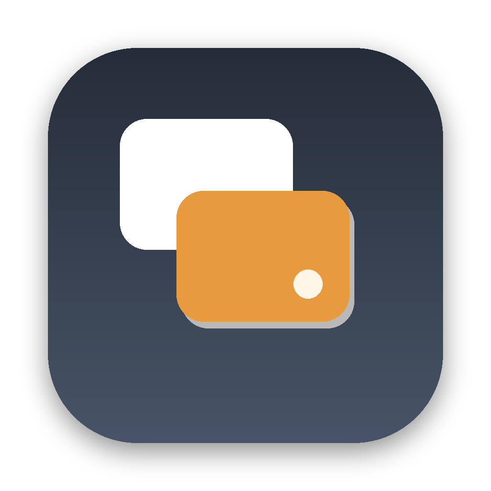
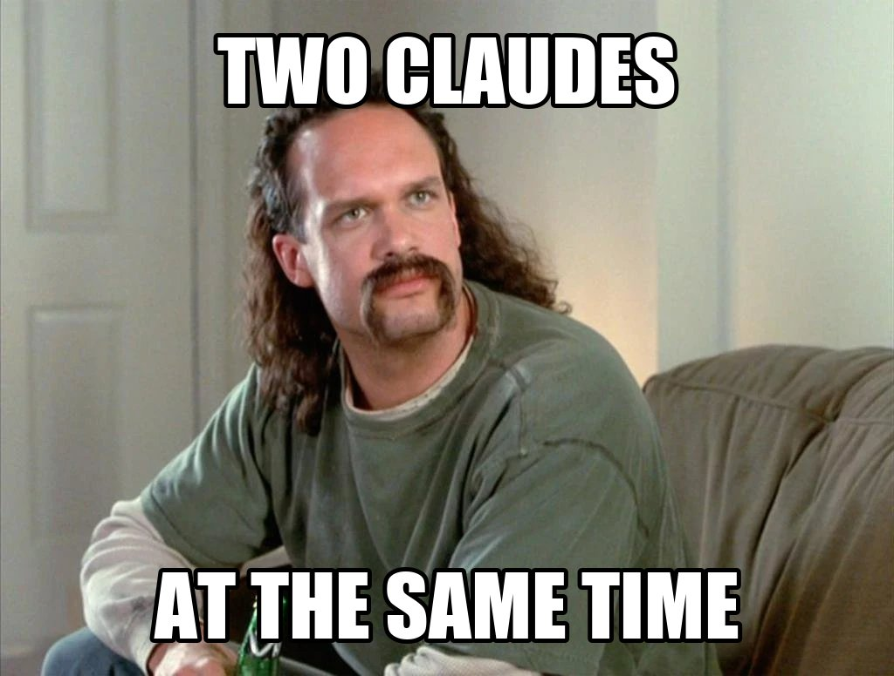
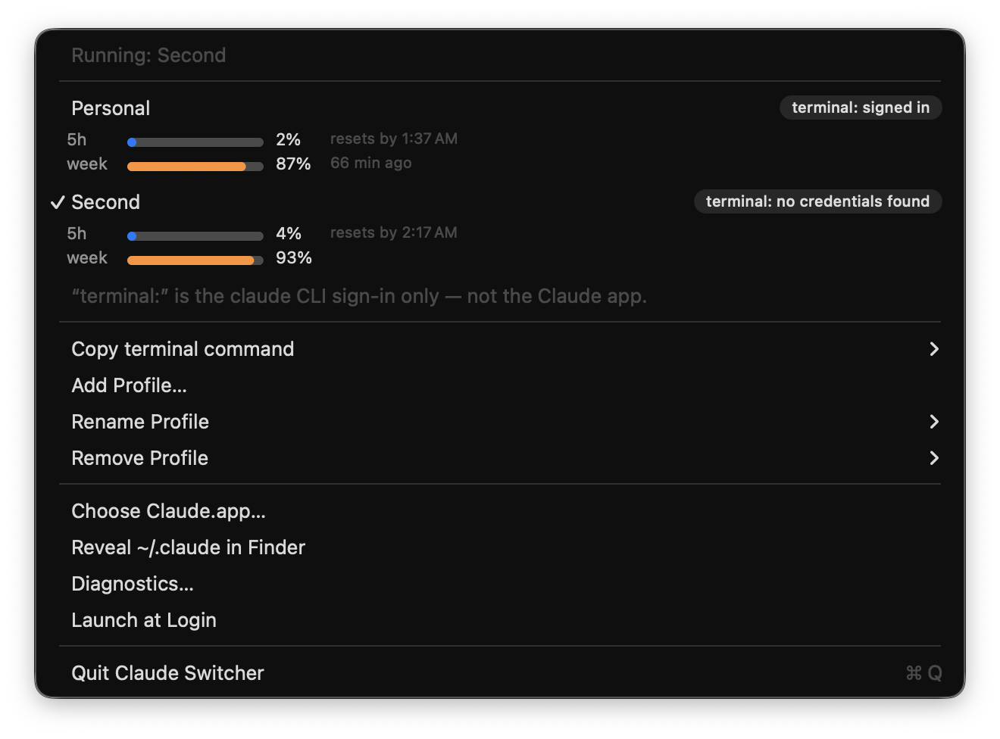

<div align="center">



# Claude Switcher

**Several Anthropic accounts on one Mac — and one shared `~/.claude`.**

[](https://github.com/kevinchau/claude-switcher/actions/workflows/ci.yml)
[](https://github.com/kevinchau/claude-switcher/releases/latest)


### [⬇︎ Download for macOS](https://github.com/kevinchau/claude-switcher/releases/latest/download/Claude.Switcher.dmg)

</div>

When one account hits its usage limit, the day stops. The usual workaround — a second config directory — gets you a second account by throwing away everything that made the first one useful.

Claude Switcher is a menu-bar app that runs multiple Anthropic accounts side by side on one Mac, in Claude Desktop (chat **and** the Code tab) and in the terminal `claude` CLI. Every account shares **one `~/.claude`**, so your memories, skills, subagents, plugins and settings follow you to all of them, and every session’s transcript stays in one place on disk. Hitting a limit costs you a menu click, not your setup. (Conversations are the exception: Claude keeps chats, and the Code tab’s session list, per account — see [§2.5](#25-the-code-tabs-session-list-is-per-account-the-transcripts-are-shared). A Code session can be [copied to another account](#copying-a-session-to-another-account), as a separate session.)

<p align="center">
  
</p>

---

## Why this exists

Burn through your Fable quota and the rest of the week turns into pulling hairs: same questions, a lot more coaxing. A second account puts you back on Fable in one click.

<p align="center">
  
</p>

The advice you will find online is to point `CLAUDE_CONFIG_DIR` at a second directory per account:

```sh
alias claude-work='CLAUDE_CONFIG_DIR=~/.claude-work claude'   # not what this tool does
```

Per [`RR()`](#21-the-config-dir-is-independent-of-the-electron-profile), that works — and it isolates **exactly the things you want to keep**: `projects/` (your session history), `history.jsonl`, `skills/`, `agents/`, `plugins/`, your memory and `CLAUDE.md`, `settings.json`, your MCP server config and your permission grants. Your second account starts as a stranger: no memory of your projects, none of your skills, none of your subagents, none of your tool permissions.

`claude-switcher` separates accounts along a different axis. The Electron profile (`--user-data-dir`) carries the *identity*; the Keychain slot (`CLAUDE_SECURESTORAGE_CONFIG_DIR`) carries the *terminal credential*; and `~/.claude` — everything you actually built up — stays shared across all of them. **Which is why this tool never sets `CLAUDE_CONFIG_DIR`, and why doing so would defeat its entire purpose.**

---

## What it looks like

The whole interface is one menu, plus a welcome window that points to it — here is the menu with two accounts running at once:

<p align="center">
  
</p>

The screenshot is from an earlier version: it still says “Profile”, shows the terminal sign-in on the account rows, and has no **Sessions** items. The text below is the current menu.

Its structure as text — one row per account, a checkmark on the ones currently up,
under each account that has run, its usage bars (see [§2.10](#210-where-the-usage-bars-come-from)),
and under every account a **Sessions** submenu (see [Copying a session to another account](#copying-a-session-to-another-account)):

```
Running: Personal
──────────────────────────────
✓ Personal
    5h    ▰▰▱▱▱▱▱▱▱▱   22%   resets by 9:13 PM (est.)
    week  ▰▰▰▰▰▰▰▰▰▱   92%   resets by Sat 10:09 PM (est.) · 2 h ago
    Sessions                     ▸
  Work
    Sessions                     ▸
  Open Source
    Sessions                     ▸
──────────────────────────────
Copy terminal command            ▸
Add Account…
Rename Account                   ▸
Remove Account                   ▸
──────────────────────────────
Choose Claude.app…
Reveal ~/.claude in Finder
Welcome…
Diagnostics…
Launch at Login
Reopen Accounts After Claude Updates
Block Claude Auto-Updates
──────────────────────────────
Quit Claude Switcher
```

The terminal CLI's sign-in is shown in one place only, the **Copy terminal command** submenu (see [Terminal](#terminal)):

```
For the claude CLI in a terminal — it signs in separately from the Claude app.
Personal              signed in
Work                  no sign-in found
Open Source           no sign-in found
```

An account's **Sessions** submenu lists its Code-tab sessions, newest activity first, each badged `open` while a running Claude has it open and otherwise with how long ago it was last active; each row opens its copy choices. Here is Personal's, with one row opened — Open Source cannot take a copy right now, and says why:

```
Fix the flaky upload test                     open      ▸
Refactor the config loader                    3 h ago   ▸
    Copy to Work…
    Copy to Open Source…                      (greyed out)
    Claude in Open Source is signed out.
Untitled — scratch-notes                      2 d ago   ▸
──────────────────────────────
Not listed: 6 archived, 2 with no transcript on this Mac
```

After a copy, the other account's **Sessions** starts with a line for it until you have opened the copy in that account's Claude:

```
“Refactor the config loader (copy)” — copied 12 min ago, not opened yet
```

When Claude has downloaded an update it cannot install — see [§2.9](#29-updates-need-every-instance-to-quit) — two more lines appear under the header:

```
Running: Personal, Work
Claude 2.110.1 is downloaded but can't install until Claude has quit on every account.
Quit All & Install Update…
```

And `claude-switcher --dry-run`, which prints the resolved launch plan and exits without launching or creating anything. Output from a run with Claude up on the default account and a second account `Work` configured, with the home directory rewritten to `/Users/me` (and the Keychain suffix recomputed to match, since it is `sha256` of that exact string — see [§2.7](#27-keychain-service-name-derivation)):

```
claude-switcher launch plan (dry run — nothing was launched or created)

Config file:  /Users/me/.config/claude-switcher/config.json
Claude.app:   /Applications/Claude.app
Shared dir:   /Users/me/.claude (shared by every account; CLAUDE_CONFIG_DIR is never set by this app)
Active account: default

Account "Personal" (id: default)  [default account]
  user data dir:   (none — the app's own default data dir)
  would create it: no
  argv:            (no arguments)
  new instance:    no (an instance for this account is already running)
  environment:     (inherited — no CLAUDE_* variables are ever injected)
  already running: yes (pid 4953) — would reopen its window and activate it instead of launching
  keychain item:   Claude Code-credentials  (terminal CLI only; existence check only — the secret is never read)
  terminal cmd:    claude
  usage:           5h 22% · week 92% · resets by 9:13 PM (est.) · week resets by Sat 10:09 PM (est.) · recorded 7:02 PM (2 h ago)  (read from this account's plan-usage-history.json; never fetched)
  update block:    off — Claude updates itself

Account "Work" (id: work)
  user data dir:   /Users/me/Library/Application Support/Claude-work
  would create it: yes (mkdir -p at launch time)
  argv:            "--user-data-dir=/Users/me/Library/Application Support/Claude-work"
  new instance:    yes (createsNewApplicationInstance — never focuses another account's window)
  environment:     (inherited — no CLAUDE_* variables are ever injected)
  already running: no — would launch
  keychain item:   Claude Code-credentials-1082021d  (terminal CLI only; existence check only — the secret is never read)
  terminal cmd:    CLAUDE_SECURESTORAGE_CONFIG_DIR="/Users/me/.claude-accounts/work" claude
  usage:           no data yet (recorded once Claude has run on this account)  (read from this account's plan-usage-history.json; never fetched)
  update block:    off — Claude updates itself
```

An account that closed itself for an update adds a `closed itself:` line ([§2.11](#211-after-an-update-claude-only-brings-back-the-default-account)). If any running instance matches no configured account, a trailing `Running instances matching no account:` block lists it by pid. A config that cannot be read is reported on stderr and exits `1`.

---

## Install

### Download the app

**[⬇︎ Claude Switcher.dmg](https://github.com/kevinchau/claude-switcher/releases/latest/download/Claude.Switcher.dmg)** — open it and drag Claude Switcher to Applications.

Signed and notarized, so it just opens. Needs macOS 14+ and Claude Desktop.

### Or build it from source

```sh
git clone https://github.com/kevinchau/claude-switcher.git
cd claude-switcher
make install
```

`make install` builds the release binary, assembles `build/Claude Switcher.app`, signs it, and copies it to `/Applications`. That is the only thing the build system touches outside the working tree — it never modifies the `Claude.app` bundle, and it never writes `~/.config/claude-switcher/config.json` (only the running app does that). Launch at Login is *not* enabled by installing; it is a menu-bar toggle.

A source build is signed with your own Developer ID certificate if you have one, and **ad-hoc** otherwise — an ad-hoc app runs only on the machine that built it, which is fine when that machine is yours. See [Signing and distribution](#signing-and-distribution).

| | |
| --- | --- |
| Toolchain | Swift 6 (Xcode 16+); developed against Swift 6.3.3 |
| Dependencies | None. AppKit and Foundation only, no Xcode project. |

### Launched it and nothing happened?

Claude Switcher has no Dock icon: it lives in the menu bar, as a two-person icon (`person.2.circle`) near the clock. The first launch opens a **welcome window** that says so, explains what an account is and that `~/.claude` stays shared, and offers **Add Account…**, **Show Menu** and **Done**. It does not open on its own for anyone who already has two or more accounts configured, and whether it has been shown is remembered in the app's own `UserDefaults`, not in `config.json`.

If the icon is not there, macOS is hiding it — because the menu bar is full (quitting a menu-bar app or two makes room), or, on macOS 26, because it is switched off in **System Settings › Menu Bar › Allow in the Menu Bar**. Either way, **open Claude Switcher again**: while it is running, that always brings the welcome window back, and its **Show Menu** button opens the same menu right there. The window is also in the menu, as **Welcome…**.

---

## Usage

### Desktop

Each account in the menu is a separate Anthropic login.

1. Open the menu-bar item and choose **Add Account…** (the welcome window has the same button). Give it a label (e.g. `Work`). The tool derives a slug id — **lowercased**, non-alphanumerics collapsed to `-` — and assigns `userDataDir = ~/Library/Application Support/Claude-<slug>` and `credDir = ~/.claude-accounts/<slug>`. Adding it **launches it immediately**: `addProfile` calls the same launch path the menu rows use, so `Claude.app` comes up right away as a second, concurrent instance with a fresh Electron profile and you land on its sign-in screen. There is no second step of finding the new account in the menu. (The alert says so before you confirm.)
2. **Sign in once, interactively, in that window.** The tool never touches credentials — you log in yourself, exactly as you would on a new Mac.
3. From then on, picking that account brings its window to the front if it is running — reopening the window if you had closed it, since Claude keeps running without one — or launches it if it is not. The default account is launched with no `--user-data-dir` argument, which selects the app's own profile directory — but it is still launched as a *new* instance whenever no instance matching it is running (see [§2.8](#28-what-the-tool-actually-does-with-all-this)).

Both accounts stay up at the same time — no quitting, no logging out, no waiting — and there is nothing special about the number two: add as many as you have. Every instance sees the same `~/.claude`, so the same skills, agents, plugins, memory and settings are there on all of them. The Code tab’s session list is not: Claude Desktop keeps it per account ([§2.5](#25-the-code-tabs-session-list-is-per-account-the-transcripts-are-shared)). To carry a session over, copy it ([below](#copying-a-session-to-another-account)).

### Terminal

The Desktop account is chosen by `--user-data-dir`; the **terminal CLI** account is chosen by `CLAUDE_SECURESTORAGE_CONFIG_DIR` (see [§2.6](#26-the-terminal-cli-is-a-separate-story)). **Copy terminal command** puts the right invocation on the pasteboard:

```sh
# default account — the variable is OMITTED, never set to ""
claude

# any other account
CLAUDE_SECURESTORAGE_CONFIG_DIR="/Users/me/.claude-accounts/work" claude
```

The first run for a new credential dir will be logged out; sign in interactively, once. The submenu's badges say which accounts' terminal slots are signed in. `~/.claude` is shared either way, so your history, skills and memory come along.

### Copying a session to another account

Claude keeps the Code tab's session list per account, so a session started on one account is not in another's list ([§2.5](#25-the-code-tabs-session-list-is-per-account-the-transcripts-are-shared)). Its transcript is in the shared `~/.claude`, though, and Claude Desktop's own fork already makes a separate session out of one — but only within one account. Claude Switcher makes the same kind of copy into another account ([§2.13](#213-copying-a-session-to-another-account)).

1. Open the account's **Sessions**, point at a session, and choose **Copy to *Work*…**.
2. Read the confirmation — it says what the copy is and is not — and click **Copy**. Nothing is written before that.
3. When the other account's sessions are idle, quit its Claude yourself (Claude › Quit) and open it again from the switcher. The copy should then be in its Code tab as *“title (copy)”* (not yet confirmed against a live Claude — [§2.13](#213-copying-a-session-to-another-account)).

**What the copy is.** A separate session, as the original is at that moment: a new session id, a new transcript next to the original's in `~/.claude/projects`, and a new entry in the other account's list. Later messages in either are not added to the other. The conversation comes across byte for byte up to its last complete line, with the transcripts of the subagents it used, its title (as `title (copy)`, then `(copy 2)`, `(copy 3)`…), its model, its effort setting and its working folder.

**When it shows up.** The next time that account's Claude starts — not before. Claude reads an account's session list when it starts; closing the window or **View › Reload** does not read it again ([§2.13](#213-copying-a-session-to-another-account)). **Claude Switcher will not quit Claude for you.** If that account's Claude is running when the copy finishes, the result says so. Until you have opened the copy there, the other account's **Sessions** begins with a line for it — `“title (copy)” — copied 12 min ago, not opened yet` — which goes once Claude has rewritten the copy's record, as it does the first time the session is viewed, or once the record is gone. **Diagnostics…** counts these copies too, and lists any copy that has not finished.

**What does not come across.**

- **Permission mode.** The copy is filed in mode **Default**; Claude Code may restore the original's mode when it first starts the copy (not yet checked against a live Claude — [§2.13](#213-copying-a-session-to-another-account)).
- **Grants and connections.** Allowed-tool grants, connectors (the other account's own apply), Remote Control, and browser-action permission (the copy asks per site).
- **Saved tool outputs and uploads** from before the copy: the conversation still points at the original's, and they disappear if the original is deleted.
- **Rewind points** from before the copy carry over only if the original still exists when the copy is first continued. Keep the original until you have opened the copy — until then nothing renews the copy's files either ([Caveats](#caveats-and-limitations)).

Also worth knowing: both sessions work in the same folder, and each can change or undo the other's file edits. If the other account's plan lacks the original's model, the first reply is a model error — pick another with `/model`; the first reply may also be slower than usual. A copy taken just after Claude was working may end mid-turn, and that turn shows as interrupted. A session Claude has hidden from history stays hidden in the copy.

**What cannot be copied.** A session that cannot be copied anywhere says **Can’t be copied** and why, in its own submenu. A reason that concerns one account greys out that **Copy to …** item and says why under it. Every refusal is one of these:

| Not copied | Why |
| --- | --- |
| Archived or remote (SSH, WSL) sessions, and sessions with no transcript on this Mac | Not listed at all; the submenu's last line counts them. A remote session's files are on another machine. |
| A session with no conversation yet, or no complete line in its transcript | There is nothing to copy yet. |
| A session in a git worktree — named in its record, under `.claude/worktrees`, or still bound in its transcript | The copy would share the worktree, and deleting or archiving either session can remove it, uncommitted work included. Claude Code re-enters a worktree bound in the transcript when the session resumes. |
| A session in a scratch workspace | Claude removes that folder when the session is deleted. |
| A session that has moved away from the folder it started in | Claude treats the starting folder as the base repository, deleting branches there. |
| A session that spans several transcripts (after a clear, a rewind or an unarchive) | Its record names more than one; a copy takes exactly one. |
| A session whose folder is gone, that Claude Switcher cannot look at (no permission on a folder above it), or not recorded as a full path | The copy runs in that same folder. |
| A session whose title or folder contains its own session id | The copy's record must not carry the original's id. Rename the session in Claude to copy it. |
| A session Claude is still replying in, or whose transcript keeps changing | The copy would end mid-reply. A read the file changed during is retried for five seconds. |
| A session watching an artifact's comments | Claude Code restores the watch when the session resumes; what it would do under another account was not traced. Stop the watch first. |
| A session whose Remote Control state cannot be cleared as Claude clears it, or with an unreadable line about Remote Control, a worktree or a watch | What the copy would inherit cannot be checked. |
| A session Claude has marked deleted | A copy would bring back what you deleted. |
| A session already registered in two accounts | Deleting it in either removes it from both ([Caveats](#caveats-and-limitations)). |
| A target that is signed out or has never been signed in | Claude loads only the signed-in account's sessions, so a copy filed elsewhere would stay invisible. |
| A target signed in to the same account as the source | There is no other account to copy into. |
| A target whose account has no Code sessions yet, or none in its current organisation | Claude makes the folder with the first session; start one there first. |
| A target whose account has several organisations | Which one is current is kept only in an encrypted cookie, which Claude Switcher does not read ([§2.13](#213-copying-a-session-to-another-account)). |
| A target that uses the same data folder, or that changes account or organisation during the copy | The record is not filed. |
| On the way to the session's files: a symbolic link anywhere from your home folder down — a symlinked `~/.claude` included — a folder or file owned by another user, or a folder others can write to | Claude Switcher does not follow links or write there ([§2.13](#213-copying-a-session-to-another-account)). Such a session is listed, not copied, and the message says it is the session's files. |
| The same on the way to the other account's Claude data folder — a link anywhere from your home folder down to its session folder (a data folder spelled through a link outside your home folder that leads back into it included), a folder of another user, or a session folder others can write to | The same rule; the message names that account's data folder, not the session's files. |
| Less free space than the copy plus 1 GB, a disk that cannot rename exclusively, something already at the copy's new name, or a session store that cannot be read | A copy must never replace anything: it needs room to spare, a rename that refuses to overwrite, and a new name provably unused in every store on the Mac. A store folder that cannot be read greys out every **Copy to …** item, and **Diagnostics…** names it. |
| Claude Switcher's own settings folder (`~/.config/claude-switcher`) on a disk that cannot rename exclusively | The copy's journal is put in place with the same exclusive rename. |
| Another copy in progress, another Claude Switcher running (copy from that one), or a lock file in `~/.config/claude-switcher` that cannot be taken at all | One copy at a time, only in the switcher that holds the automation lock. Each case has its own message. A recovery pass under way is waited for, not refused. |

A copy that is interrupted — a crash, a power cut, a forced quit — is finished or cleaned up the next time Claude Switcher starts — or, when it cannot prove a leftover is its own, left exactly as it is — and a line near the top of the menu says which ([§2.13](#213-copying-a-session-to-another-account)).

<details>
<summary><b>Every menu item, in detail</b></summary>

The menu is rebuilt on every open so running state is fresh.

- A disabled header: `Running: Personal, Work` — or `Claude is not running`.
- **Quit All & Install Update…**, under a disabled line naming the version — shown only while Claude has an update downloaded, its installer is alive and waiting, and at least one instance is running (see [§2.9](#29-updates-need-every-instance-to-quit)). It confirms first, naming the accounts it will quit and reopen and any unrecognized instances it will quit and *not* reopen. It then asks every instance to quit (the same as ⌘Q — never forced), waits for Claude's own installer to finish, and reopens the accounts that were running; if an instance will not quit, nothing is reopened and it says which accounts are closed. While it runs, a progress line replaces the offer. **This is the only thing in the app that ever quits Claude, and it never happens on its own.**
- Under each account that has ever run, its **usage bars**: one drawn row per limit Claude reports for that account — `5h` (the five-hour session) and `week`, plus `Opus`, `Sonnet`, `Cowork`, `apps` or `extra` when the account has those — with the percentage, a bar that turns orange at 80 % and red at 100 %, and a note: the session row says when the window ends ("resets by 9:13 PM (est.)"), the week row says when the week resets ("resets by Sat 10:09 PM (est.)", once a reset has been observed) and how old the reading is. Both times are marked estimated: Claude does not record the exact reset time locally, so they are inferred from the account's history — each is the latest the reset can be, worked out as [§2.10](#210-where-the-usage-bars-come-from) describes. A dash means the period has certainly ended since the reading. Hover for the full picture. Read from the account's own `plan-usage-history.json`, never fetched — [§2.10](#210-where-the-usage-bars-come-from).
- One item per account: the label and a checkmark when an instance for that account is running. Selecting a running account brings its window to the front, reopening the window if it was closed ([§2.8](#28-what-the-tool-actually-does-with-all-this)); selecting one that is not running starts it.
- Under every account, **Sessions** — a submenu of that account's Code-tab sessions ([Copying a session](#copying-a-session-to-another-account)). It lists the account's non-archived local sessions whose transcript is on this Mac, newest activity first, at most 20; a last line counts the rest (`Not listed: 3 older, 6 archived, 2 with no transcript on this Mac, 1 remote`). Each row is the session's title (or *Untitled — folder*), badged `open` while a running Claude has it open and otherwise with its age; hovering shows its folder, last activity, model and transcript size. Its submenu has one **Copy to *account*…** per other account, or the reason it cannot be copied. Above the rows, one line for each copy made into this account that has not been opened yet. If the account's Claude is signed in to a different account than the sessions saved there, or several accounts or organisations have used it, the submenu says that instead of listing anything. Like the Keychain badges, the lists are read in the background — read-only: every account's session records and three keys of its `config.json`, the transcripts' folders (each listed session's transcript and working folder are looked at, not opened), the free space on the volume of `~/.claude/projects`, Claude Code's `~/.claude/sessions` registry, the session folders of every `~/Library/Application Support/Claude*` folder, configured or not (a copy needs every one of them readable), and the switcher's own copy journal — and a first open can show `Reading sessions…` until the read lands, after which only the Sessions submenus are replaced.
- **Copy terminal command** — a submenu. Its first line is a disabled note, "For the claude CLI in a terminal — it signs in separately from the Claude app.", then one item per account (see [Terminal](#terminal) above), each with a badge for the terminal CLI's sign-in, from `MenuBuilder.hintText`:

  | probe result | badge |
  | --- | --- |
  | a credential item exists | `signed in` |
  | no credential item found | `no sign-in found` |
  | not probed yet | *(no badge)* |

  No badge is what you see before the background Keychain probe reports — the menu is built from a cached snapshot and never blocks on a `security` call, so a first open can show none briefly; the badges are then patched in place rather than rebuilding the menu under the cursor. Hovering a `no sign-in found` item says what to do: run the command, then sign in once in the terminal. Note that the probe reports **failure the same as genuine absence**: `KeychainProbe.isSignedIn` returns `false` on any thrown error, timeout or non-zero exit, which is why the badge says `no sign-in found` and not "not signed in": no credential item was found, which is not always the same thing. If no `claude` CLI was found on the Mac at all, the submenu says that too, in a second disabled line (it used to be an alert at launch). **The badge describes the terminal CLI only** — the Desktop login is separate and is not something the tool can inspect, which is why the badge is here and not on the account rows.
- **Add Account…**, **Rename Account** (one item per account; changes only the label shown in the menu — the id, both directories and therefore the Keychain service name stay exactly as they are), and **Remove Account** (disabled for the default account, listed as `(default account)`, and for the active one, listed as `(active)`; confirms first; **never deletes the account's data directories**, and says so in the dialog).
- **Choose Claude.app…** — an `NSOpenPanel`, offered when the configured path is missing or on request.
- **Reveal ~/.claude in Finder**.
- **Welcome…** — reopens the welcome window ([Launched it and nothing happened?](#launched-it-and-nothing-happened)).
- **Diagnostics** — a selectable-text alert with: the config path; the resolved `Claude.app` path, its `CFBundleIdentifier` and version, any staged update and whether Claude's installer is running; the shared config dir (`~/.claude`) and confirmation that `CLAUDE_CONFIG_DIR` is unset; each account with its normalized directories, derived Keychain service name, running pid and last recorded usage, and a `code sessions:` line — counts only, never a title or a folder, plus the first eight characters of the account and organisation folder the list was read from; a `SESSION COPIES` section — the count of copies made but not yet opened, one line per copy that has not finished (its account, whether it was still staging or already staged, since when, and where its `.claude-switcher-*` leftovers would be), what the last recovery pass said, and a session folder that cannot be read, by path; and the `claude` CLI version for both the `PATH` binary and the app-managed sidecar if present.
- **Reopen Accounts After Claude Updates** (on by default) — when Claude updates itself it closes, and its installer only ever reopens the default account. With this on, the other accounts that closed *for the update* are started again, in the background, once it is installed ([§2.11](#211-after-an-update-claude-only-brings-back-the-default-account)). It is the one thing the app does to Claude on its own initiative, and it can only launch: nothing is ever quit by it. (The one other thing done unasked is file work, not process work: finishing or cleaning up a session copy that was interrupted — [§2.13](#213-copying-a-session-to-another-account).) When it has acted, the next menu open says so in one line.
- **Block Claude Auto-Updates** (off by default) — stops Claude Desktop from downloading or installing updates at all, through Claude's own `disableAutoUpdates` policy, so it never closes itself to update ([§2.12](#212-blocking-claudes-auto-updates)). Turning it on asks first and spells out the cost. It applies the next time each account starts; nothing is quit to apply it.
- **Launch at Login** — a checkbox bound to `SMAppService.mainApp`, reflecting `.status`. A bundle that has never been registered reports `.notFound`, which is *not* an error: it is shown as an unchecked box and clicking it registers. The item is greyed out only when the process is not inside an `.app` bundle (`swift run`), where there is nothing launchd could register.
- **Quit**.

Launches are serialized, but only the items that could start a second one are gated on the in-flight flag: **the account rows, Add Account…, the Rename Account submenu and the Remove Account submenu** go disabled while a launch is in flight and re-enable on completion (a 30-second watchdog re-enables them if a completion handler never arrives); the welcome window's **Add Account…** button stays clickable and just beeps meanwhile. Nothing that saves — adding, renaming or removing an account, choosing Claude.app, the two update toggles — runs while `config.json` cannot be read: what is in memory then is the last good settings or the defaults, and saving would write them over the file you are fixing. **Copy terminal command, Choose Claude.app…, Reveal ~/.claude, Welcome…, Diagnostics…, Launch at Login and Quit stay enabled throughout.** The account rows additionally require the configured `Claude.app` to exist.

Session copies have a gate of their own: one at a time. While one runs, a progress line (`Copying “title” to Work…`) sits under the `Running:` header and every **Copy to …** item is disabled; the Sessions submenus themselves stay open to browse. Each **Copy to …** is checked again when you confirm: if either account was removed or now points at another data folder meanwhile, nothing is copied and an alert says so. The result is one alert; when the copy did not go through, recovery runs first and what it did is in the same alert. When the recovery pass at launch has finished, cleaned up or left something, one short line under the `Running:` header says how many of each (`Session copies: 1 finished or cleaned up, 1 needs attention — see Diagnostics…`), with the full notes in its tooltip, until the menu has been opened once; **Diagnostics…** shows the notes of the last recovery pass the app ran until a pass has nothing to say. For as long as any copy has not finished, a second line says so at every open (`1 session copy has not finished — see Diagnostics…`).

An update install holds the same flag from confirmation until the last account is back, and additionally disables **Choose Claude.app…** and **Quit** — quitting the switcher mid-install would leave every account closed with nothing to reopen it.

</details>

---

## What's shared, what's per-account

| State | Location | Shared or per-account |
| --- | --- | --- |
| Project + session transcripts | `~/.claude/projects/` | **Shared** across every account |
| Prompt history | `~/.claude/history.jsonl` | **Shared** |
| Skills | `~/.claude/skills/` | **Shared** |
| Subagents | `~/.claude/agents/` | **Shared** |
| Plugins | `~/.claude/plugins/` | **Shared** |
| Memory and `CLAUDE.md` | `~/.claude/` | **Shared** |
| Settings (incl. MCP servers, permissions) | `~/.claude/settings.json` | **Shared** |
| Code tab session list | `claude-code-sessions/<account>/<organisation>/` in the Electron profile | Per-account. Each record points at a transcript in the shared `~/.claude/projects/`, but an account lists only the sessions it started ([§2.5](#25-the-code-tabs-session-list-is-per-account-the-transcripts-are-shared)). A session can be copied into another account's list, as a new session with its own transcript ([§2.13](#213-copying-a-session-to-another-account)). |
| Desktop app login / identity | Electron profile (`--user-data-dir`) | Per-account |
| Cookies, Local Storage, IndexedDB | Electron profile | Per-account |
| Desktop MCP config | `claude_desktop_config.json` in the Electron profile | Per-account |
| Chat history | server-side, on the Anthropic account | Per-account (cannot be shared) |
| Cowork / remote sessions | server-side | Per-account |
| Usage limits and plan | server-side | Per-account. Claude Desktop records each account's usage into its own profile directory; the switcher shows those readings ([§2.10](#210-where-the-usage-bars-come-from)). |
| Terminal CLI credentials | Keychain item, service name from [§2.7](#27-keychain-service-name-derivation) | Per-account (per `credDir`) |

---

## How it works

Everything below was established empirically, by reading the shipped `Claude.app` JavaScript and by running live tests. It is *not* how the app is documented to behave — see [Caveats and limitations](#caveats-and-limitations). Where something has not been run against a live Claude, the section says so: the window request in [§2.8](#28-what-the-tool-actually-does-with-all-this), and the session copy in [§2.13](#213-copying-a-session-to-another-account).

### 2.1 The config dir is independent of the Electron profile

The app resolves its Claude config directory with exactly this function (from the shipped bundle, names minified):

```js
function RR(){ let e = process.env.CLAUDE_CONFIG_DIR; return e ? zw(e) : join(homedir(), ".claude") }
```

That is: `CLAUDE_CONFIG_DIR ?? ~/.claude`. It has **no relationship to `--user-data-dir`**. So you can give the app a completely separate Electron profile — a separate login, a separate account — and it will still read and write the same `~/.claude`.

This is the mechanism the whole tool is built on. **`claude-switcher` therefore never sets or modifies `CLAUDE_CONFIG_DIR`, anywhere.** Setting it would isolate exactly the state we are trying to share.

### 2.2 `--user-data-dir` gives you a separate account

`Claude.app` is an Electron app, and `--user-data-dir=<dir>` is Electron's own flag for choosing the profile directory. Passing it produces a fresh Electron profile: launching with a new directory populates it with `Local Storage/`, `Cookies`, `IndexedDB/` and `claude_desktop_config.json`, and the app comes up logged out. Signing in there creates a second, independent app login — **for both the chat side and the Code tab** — while `~/.claude` ([§2.1](#21-the-config-dir-is-independent-of-the-electron-profile)) remains shared.

### 2.3 Instances run concurrently

There is **no `requestSingleInstanceLock` anywhere in the app**. Multiple instances with different `--user-data-dir` values run side by side. Switching accounts is therefore *launching or focusing another instance* — there is no quitting, no logging out, no waiting. (Running side by side has one cost, and it is the only time anything needs to quit: Claude's updater — [§2.9](#29-updates-need-every-instance-to-quit).)

### 2.4 The Code tab does not read the Keychain

The Code tab's credentials do not come from the macOS Keychain. The app injects `CLAUDE_CODE_OAUTH_TOKEN` directly into the environment of the `claude-code` sidecar process it spawns. Two consequences:

- Setting `CLAUDE_SECURESTORAGE_CONFIG_DIR` on `Claude.app` has **no effect on the Code tab**. The Desktop account — chat and Code tab alike — is selected *purely* by `--user-data-dir`.
- `claude-switcher` never sets `CLAUDE_CODE_OAUTH_TOKEN` and never puts any `CLAUDE_*` variable into a launched app's environment.

### 2.5 The Code tab's session list is per account; the transcripts are shared

As of Claude Desktop 2.19675.0 the Code tab's sidebar is **not** built from `~/.claude/projects`. Each instance keeps one record per session at `<user-data dir>/claude-code-sessions/<account>/<organisation>/local_<id>.json` and lists only those: its `getStorageDir()` joins the user-data dir, the signed-in account and its organisation, and the loader reads nothing but the `local_*.json` files there. A record names its transcript by id, and the transcript is in the shared `~/.claude/projects/<cwd-slug>/<id>.jsonl` ([§2.1](#21-the-config-dir-is-independent-of-the-electron-profile)).

So every account's transcripts sit side by side on disk, but an account's list shows only the sessions it started. (On the machine this was checked on: 158 records in one profile, 17 in the other, no transcript claimed by both.) The one reader of `~/.claude/projects` that applies no account filter is the Code tab's “CLI sessions” list, and it deliberately skips sessions that were started in the desktop app.

An earlier version of this README said the list was enumerated from `~/.claude/projects` with no account filter. That is not what this version of the app does; the build it was read from is no longer available to re-check.

Making two accounts' records point at **one** transcript is not a way round it. Each instance decides whether a transcript may be deleted from the claims it can see, and the default profile cannot see the claims of a `Claude-<slug>` profile — delete the session in one account and the file the other still uses can go with it. Claude's own store also refuses symlinked directories and hard-linked transcripts. What does work is a copy with its own id and its own transcript, which is what [§2.13](#213-copying-a-session-to-another-account) makes.

### 2.6 The terminal CLI is a separate story

For the **terminal `claude` CLI only**, `CLAUDE_SECURESTORAGE_CONFIG_DIR=<dir>` selects a separate credential slot while still sharing `~/.claude`. Verified with `claude auth status`: logged in by default, `loggedIn: false` with the variable pointed at a fresh directory.

The variable must be **omitted entirely** for the default account. Never pass it as an empty string — the CLI branches on whether the variable is *defined*, not on whether it has a useful value.

### 2.7 Keychain service-name derivation

The CLI derives its Keychain service name like this (again from the shipped binary):

```js
oG(e = ""){
  t = env.CLAUDE_SECURESTORAGE_CONFIG_DIR;
  r = t !== undefined ? !t : !env.CLAUDE_CONFIG_DIR;
  n = t !== undefined ? NFC(t) : configDir();
  o = r ? "" : "-" + sha256(n).hex.slice(0, 8);
  return "Claude Code" + OAUTH_FILE_SUFFIX + e + o;
}
```

`OAUTH_FILE_SUFFIX` is `""` in production and `e` is `"-credentials"`, so:

| credential dir | Keychain service name |
| --- | --- |
| not set (`nil`) | `Claude Code-credentials` |
| set to `<dir>` | `Claude Code-credentials-` + first 8 **lowercase** hex chars of `sha256(NFC(<dir>))` |

The hash covers **exactly the string handed to the CLI**, so `claude-switcher` normalizes the path first and hashes the normalized result — the same string it would export.

> **Trap:** pointing an account's credential dir at `~/.claude` *itself* still yields a hashed service name, not the default one, because the branch keys off whether the variable is defined, not off its value.

### 2.8 What the tool actually does with all this

- **Desktop:** launch `Claude.app` via `NSWorkspace.shared.openApplication(at:configuration:)`. `arguments = ["--user-data-dir=<normalized dir>"]` is set **only** when the account has a `userDataDir`; the default account passes **no** arguments, because omitting the flag is exactly what selects the app's own profile directory. It never shells out to `/usr/bin/open`, and never modifies or duplicates the `Claude.app` bundle.
- **`createsNewApplicationInstance = true` is set unconditionally.** Not "only for named accounts" — the launch path is reached *only after* establishing that no running instance matches the requested account, and at that point a new process is always what is wanted, the default account included. This must not be made conditional on `userDataDir != nil`. With the flag `false`, `openApplication` activates **any** running instance of the bundle; it has no idea that instance belongs to a different Electron profile. Choosing the default account while only a named account was running would then bring the **wrong account's** window to the front, return that instance's pid, and have the tool record the switch as a success. That was a real, high-severity defect. Leave it unconditional.
- **Matching running instances to accounts is three-valued.** Each process's `argv` is read via `sysctl(KERN_PROCARGS2)` (so paths containing spaces parse correctly, and both the `--user-data-dir=VALUE` and `--user-data-dir VALUE` spellings are accepted) and classified into an `InstanceProfile`:
  - `.defaultProfile` — no `--user-data-dir` argument (or an empty value). This *is* the default account.
  - `.directory(String)` — launched with `--user-data-dir=<dir>`, normalized. Matches the account whose normalized `userDataDir` is equal.
  - `.unknown` — the argument vector could not be read at all. **Matches no account, ever.**

  The third case is the point: "no `--user-data-dir`" and "we could not read the command line" are entirely different claims. The first identifies the default account; the second identifies *nothing*. Folding them together (`ProcessArgs.arguments(forPID:)` returning `[]` instead of `nil`, say) would make every process the tool lacks permission to inspect masquerade as the user's default account — showing the wrong account as running, and letting a "focus" action raise an unrelated window while the UI reported success.
- **Launching when unreadable instances exist asks first.** If any running instance is `.unknown`, the tool cannot prove it is *not* the account you just picked, and starting a second Electron process against one user-data dir puts two Chromium processes on one LevelDB store. Rather than refuse, it presents a confirmation alert naming how many processes did not report a command line, offering **Start Anyway** / **Cancel**.
- If an account's instance is already running, the tool activates it instead of launching a second copy. Activation re-checks the target process's bundle identifier first, because the menu acts on a snapshot and a pid can be reused between opening the menu and clicking.
- **Activating also asks for the window.** Activation alone raises only the windows an app already has, and Claude Desktop keeps running after its main window is closed — so selecting such an account used to bring nothing up. `InstanceManager.activate` therefore first sends that one process the "reopen" Apple event (`kAEReopenApplication`, the event a Dock click sends), then activates it. Claude Desktop (as of 2.19675.0) answers by showing its main window: un-hiding it, restoring it from the Dock, or creating it again. Only a process whose bundle id was just checked against Claude's is sent the event; if that id cannot be read, the instance is activated and nothing more. The event is addressed **by pid**, for the same reason `createsNewApplicationInstance` is unconditional: every account is the same app bundle, so anything that names the app instead (`NSWorkspace.openApplication`, `open -a`) reaches whichever instance LaunchServices picks — possibly the wrong account's. It is best-effort, sent from a background queue and never waited on (`kAENoReply`), with `kAEDoNotPromptForUserConsent` so that it cannot raise a permission dialog; if macOS refuses the send, the instance is simply activated as before. A refusal would otherwise be invisible, so the result of the last request is kept and shown in **Diagnostics…** as `window request:`. This was verified with stand-in apps — of two running instances, a pid-addressed reopen sent by this code reaches only the one addressed — and by reading Claude's handler for the event. It has **not** been verified from the installed, signed app against a live Claude: whether macOS lets it through there without an Automation grant is exactly what that Diagnostics line is for.
- **Bundle identifier:** read `CFBundleIdentifier` from the configured app's `Info.plist`. Never hardcoded.
- **Terminal:** the tool does not run the CLI for you. It copies the right command to the pasteboard and reports sign-in state in the same submenu.
- **Credentials:** the tool performs **existence checks only**, via `security find-generic-password -s "<service>" -a "$USER"`. It never passes `-w`, and never reads, writes, copies, migrates or deletes a Keychain secret. Any failure degrades silently to the same answer as a genuine absence (see the badge table under [Usage](#usage)).

### 2.9 Updates need every instance to quit

Claude Desktop updates itself with Squirrel. When an update has downloaded, the app starts a helper, `ShipIt`, that notes every instance of the app running at that moment, waits until **all of them** have exited, and only then swaps the bundle. (Each running instance re-requests the install at its hourly update check, which restarts the helper with a fresh list.) Claude also updates "stealthily": after an idle timeout it quits itself (`beforeQuitForUpdate … going down for update` in `~/Library/Logs/Claude/main.log`), expecting the helper to install and bring it back.

With one instance the install goes through — observed end to end in about seven seconds — but what comes back is **only the default account**: the installer relaunches Claude with no arguments, so a named account that quit itself stays closed even after a successful update. That half of the problem is [§2.11](#211-after-an-update-claude-only-brings-back-the-default-account)'s. With two it cannot: the other account never exits, so the helper never starts installing, and **the account that quit itself stays closed**. Reopening it by hand only restarts the cycle — it re-requests the install and quits again the next time it goes idle. The tell-tale is `~/Library/Caches/<bundle id>.ShipIt/ShipIt_stderr.log` filling with `Detected this as an install request` lines that are never followed by `Beginning installation`.

The switcher cannot change how Claude's updater works, so it does the two things it can:

- **It notices.** On every menu open it reads the helper's request file (`ShipItState.plist` — JSON, despite the name), the `Info.plist` of the downloaded bundle it points at and of the installed app, and scans process names for a live `ShipIt` whose job label is `<bundle id>.ShipIt`. An update counts as blocked only when the request names the configured app, the downloaded bundle still exists inside the helper's cache directory with a different version, *and* a helper is alive to install it — the request file outlives the install it describes, so its presence alone means nothing. Versions are read straight from the plist file, never through `Bundle`, which caches per path and would not notice the app being replaced.
- **It offers the way through: Quit All & Install Update….** After you confirm, it asks each running instance to quit with `NSRunningApplication.terminate()` (the same request as ⌘Q), waits until none is left, waits for the helper to exit, and then reopens the accounts that were running — named accounts first, the default account last, skipping any that are already back, because the helper sometimes reopens the default account itself.

The sequence is deliberately timid:

- It quits only the instances that were running when you confirmed, and quits nothing if that set has changed.
- It never escalates: no `forceTerminate()`, no signals. An instance showing a dialog of its own just runs out the one-minute clock — and then **nothing is reopened**. The helper only waits for the instances it listed when it started, so it may begin the moment the last of *those* quits; an account reopened now could be running from a bundle that is about to be moved away. The alert names the accounts left closed.
- It launches nothing until the helper has *stayed* gone for three seconds. One absent poll proves nothing: a failed install attempt exits and launchd restarts the helper within about two seconds, and the restarted one installs immediately. If the helper is still going after three minutes it reopens nothing and says so. The single exception: once the new version is on disk, only the helper's own relaunch step remains, so after a 15-second grace the accounts are reopened even if it lingers.
- It will not start an account while an instance it cannot identify is running, since that could be the very account it is about to start — two processes on one profile directory can corrupt that login.

Everything here is read-only apart from the quit request itself: nothing under the helper's cache directory is written, moved or deleted, the helper is never started by this tool, and the `Claude.app` bundle is only ever replaced by Claude's own installer.

### 2.10 Where the usage bars come from

Other menu-bar meters get Claude usage by reading the OAuth token out of the Keychain, reusing browser cookies, or driving the CLI. This tool does none of that ([rule 1](#appendix-b--hard-constraints)) — and the Keychain token is the *terminal's* account anyway, not the Desktop app's.

Claude Desktop already keeps the answer, per account. Each running instance samples its account's plan usage and appends it to `plan-usage-history.json` **in its own user-data directory** — `~/Library/Application Support/Claude/` for the default account, the account's `--user-data-dir` otherwise. Read out of the app's sampler: a sample is `{"t": <ms>, "org": "<uuid>", "u": {…}}`, appended at most every 270 seconds per org (about every 15 minutes in practice), kept for 30 days, written atomically. `u` maps each limit the account has to a utilization percentage: `fh` the five-hour session, `sd` the week, and only for accounts that have them `so` / `sn` (weekly Opus / Sonnet), `cw` (Cowork), `oa` (OAuth apps), `xu` (extra usage) and a couple of others. Reset times are not stored — the app receives them but keeps only the percentages. A legacy `version: 1` layout (`fh`/`sd` beside `t`) reads the same.

The switcher reads that file when the menu opens and shows the latest sample of the org the account is currently on. Two things make the numbers honest rather than merely present:

- **Freshness.** The app records only while that account is open, so a closed account's reading is its last observation. Weekly usage only rises until the reset, so a stale value is a floor; the week row carries the reading's age once it is over 30 minutes old, and reads "—" once it is a week old. Usage from claude.ai or the phone on the same account shows up only the next time that account is open.
- **The session window's end is a certain bound, not a guess.** Inside one five-hour window utilization never decreases and the window is five hours long, so the longest trailing run of non-decreasing `fh` samples spanning under five hours lies within one window. The window was already running at that run's first positive sample, so it ends *no later than* five hours after it — that is the "resets by" shown. The sample before the run (a drop, or one five hours older) belongs to an earlier window, so it ends *no earlier than* five hours after that — the tooltip shows both bounds. While an account is open the interval is about one sampling gap wide; after an idle stretch it is wider, and the row still only ever claims the safe end. Once "resets by" has passed the row shows "—": a new window may have started on another device, unseen. A `0` sample is treated as an ordinary member of a run, because the histories on this Mac show windows that had already started before a sample that still read 0.

- **The weekly reset is a schedule, and the bound tightens over time.** The weekly limit resets at the same weekday and time every week (re-anchored only when the plan changes). Every observed drop in the weekly figure brackets one reset between two consecutive samples, and since the schedule repeats, the brackets of earlier weeks are the same moment shifted by whole weeks: where they agree they are intersected, so the longer the app has been open around reset time, the narrower the "resets by" on the week row. A bracket that does not line up with the latest one is a re-anchoring and is ignored; a bracket a week or wider says nothing and is skipped. Once a scheduled reset has certainly fallen between the reading and now, the row shows "—". An account that has never been open across a reset shows no weekly reset yet — its first observed one starts the schedule.

The file is only ever read. Nothing is written, moved or deleted, nothing is fetched, and no token or cookie is touched for this. If a Claude update changes the format, the bars disappear rather than mislead.

### 2.11 After an update, Claude only brings back the default account

Observed: a named account quit itself for an update at 00:58:00 (stopping two Code sessions on the way down); the install ran 00:58:01–05; the installer relaunched Claude at 00:58:07 — with no arguments, which is the *default* account. The named account stayed closed for eight hours.

Claude leaves a precise record of this. Every quit-for-update — the idle "stealth" update and "install now", and no other kind of quit — writes `update-attempt` into that account's own user-data directory: `{"fromVersion", "toVersion", "ts"}`. Only that account's next launch reads and deletes it (it is how Claude logs "Previous update install succeeded"). So a marker that is still there, for an account that is not running, whose `fromVersion` is no longer the installed version, means exactly: *this account closed itself for an update that has since been installed.* An account you quit yourself has no marker and is never reopened.

With **Reopen Accounts After Claude Updates** on, the switcher watches for Claude instances going away (and looks once at startup and on wake), and then:

- waits for Claude's installer to have *stayed* gone — and never launches while one is alive, not even the one that lingers after installing;
- stands down when another instance is blocking the install ([§2.9](#29-updates-need-every-instance-to-quit)): an account reopened then would only quit itself for the same update again, so nothing is launched and no timer is left running — the install cannot start without another instance quitting, which is what triggers the next look;
- starts the named accounts in the background — it asks macOS not to bring them to the front; how Claude then restores its own window is Claude's decision — skipping any that are already up, checking again before *each* launch that no installer has appeared, never while an instance it cannot identify is running, and one launcher at a time with the menu;
- treats the **default account** more warily: Claude's installer relaunches it itself, just before it exits, so it is only started here if it is still absent fifteen seconds after the installer has gone. Two processes on the default account's data is the failure this guards against;
- does all of this from **one** switcher process only: a lock file in `~/.config/claude-switcher/` means a second copy of the switcher (a `swift run` next to the installed app) never doubles a launch;
- ignores markers from before the last boot, older than a day, or already acted on.

The default-account instance the installer starts is left alone even if you did not have it open: **anything this app does to Claude on its own initiative only ever launches.** The code that runs it is handed effects that can start things and nothing else — there is no way to quit from it — and the marker file is only ever read. (The one other thing the app does unasked touches files, not Claude: finishing or cleaning up an interrupted session copy, [§2.13](#213-copying-a-session-to-another-account).)

### 2.12 Blocking Claude's auto-updates

Reopening puts an account back, but the sessions it was running were still stopped. Claude Desktop has a supported switch for not updating at all: the policy key `disableAutoUpdates` ("Block auto-updates"). With it set the updater never starts.

Claude reads policy from a root-owned plist in `/Library/Managed Preferences` — an administrator's channel, which this tool never touches — and, when no such plist is in force, from a per-profile *configuration library*: `<user-data dir>-3p/configLibrary/_meta.json` names the applied configuration and `<id>.json` holds it (`Claude-3p` for the default account). Verified against a throwaway instance on a temporary profile: with `{"disableAutoUpdates": true}` applied, Claude logged `[updater] Auto-updates disabled by enterprise policy` and never enabled its updater, and nothing else about the app changed.

**Block Claude Auto-Updates** writes exactly those two files for every account (and for accounts added later, before their first launch). What it costs, from the app's own code: security and compatibility fixes stop arriving; the Code tab's `claude` CLI stops updating too; "Check for Updates…" disappears from Claude's menu; Claude reports `update disabled: enterprise_policy` in its telemetry; and an update that is *already* downloaded still installs. To update, turn the block off and restart an account.

Apart from a session copy's files ([§2.13](#213-copying-a-session-to-another-account)), made only when you confirm a copy, these are the only files this tool ever creates inside Claude's data area, and only on your toggle. The rule for everything it does here: **a file is ours only if it is a regular file, readable, and says exactly what this tool wrote.** Anything else at either path makes the whole library someone else's, and it is then **never touched** — not overwritten, not merged into, not removed; the account is reported as left alone. That covers another configuration being applied, an organization-managed pointer, an index that cannot be read, a directory or a symbolic link where a file should be, a symlinked library directory — and the subtle one: Claude's own setup screen saves into whichever configuration is open, and with the block on ours is the only one, so a file *with our id* may come to hold your provider settings. "Exists but is not exactly ours" is never treated as "ours, but damaged"; only one of our two files being cleanly absent is. Each path is looked at again immediately before it is written or unlinked. Turning the block off unlinks only files that are still exactly ours, then `rmdir`s the library directory — which succeeds only if it is truly empty; its parent is Claude's own directory and is never removed.

### 2.13 Copying a session to another account

Claude Desktop can already turn one session into two. Its Code tab's fork (`LocalSessionManager.forkSession`, read in Desktop 2.19675.0) copies the transcript, unchanged, to a new id in the same project folder; appends one line for each Remote Control pointer still live, clearing it; copies the subagent transcripts the conversation references; and files a new record. It will not fork across accounts — *"Cannot fork: the account changed while the fork was being prepared."* Claude Switcher makes the same copy into another account, with a record built for that account instead of one carried over.

**Where a session is.** A record in the account's store, `<user-data dir>/claude-code-sessions/<account>/<organisation>/local_<id>.json` ([§2.5](#25-the-code-tabs-session-list-is-per-account-the-transcripts-are-shared)), names a transcript, `~/.claude/projects/<slug>/<cliSessionId>.jsonl`; the transcripts of its subagents are in `~/.claude/projects/<slug>/<cliSessionId>/subagents/agent-<agent id>.jsonl` (older ones flat, as `~/.claude/projects/<slug>/agent-<agent id>.jsonl`). `<slug>` is Desktop's `cliProjectDirSlug` of the record's `cwd`, ported exactly: the raw string NFC-composed, every UTF-16 unit that is not an ASCII letter or digit replaced by `-`, and past 200 units the first 200 followed by `-` and the base-36 magnitude of a 31-multiplier hash of the whole string. The `cwd` is deliberately not normalized first — collapsing a `//` or dropping a trailing `/` would name a different folder.

**What a copy creates.** With `<X>` the original's transcript id and `<Y>` a fresh lowercase UUID — this, and nothing else:

| Where | What |
| --- | --- |
| `~/.claude/projects/<slug>/`, the original's own project folder | `<Y>.jsonl` — the transcript |
| the same folder | `<Y>/subagents/agent-<id>.jsonl` — one per referenced subagent transcript found; the folders only when there is at least one |
| the target's store, `claude-code-sessions/<account>/<organisation>/` in its profile | `local_<Y>.json` — the record |
| `~/.config/claude-switcher/copies/` (made `0700` if absent) | `<Y>.json` — the journal, written by way of `.<Y>.json.partial` |

While a copy is under way, the three pieces in Claude's folders exist under staging names instead — `.claude-switcher-copy-<Y>.jsonl.partial` and `.claude-switcher-copy-<Y>.dir` (holding `subagents/`) in the project folder, `.claude-switcher-record-<Y>.partial` in the store — and are renamed into place at the end. Claude does not load them: Desktop loads only `local_*.json` and its startup repair touches only `local_*.json.tmp`, a transcript is `<id>.jsonl`, and the names avoid every temporary-file pattern Claude uses. The one Claude process known to look inside the staging folder — the terminal CLI's cleanup, which removes old files from any `subagents/` folder — goes by modification time, one more reason every file is written fresh, never cloned: its own inode, one link, a modification time of now. Files are `0600` and folders `0700` whatever the umask. Nothing is written into the source account's store, into `<X>.jsonl` or `<X>/`, or into `~/.claude/file-history`, `uploads` or any tool-results folder.

**The transcript.** `<X>.jsonl` is opened once, without following a link and without blocking (so a pipe planted at the name cannot hang the copy); it must be a regular file with one link, yours, and not empty. It is read with `pread` up to the size seen at open; then the same descriptor's `fstat` and an `lstat` of the name must show the same size, modification time, change time and inode, and no read may have come up short. Anything else — Claude appending, rewriting in place, truncating, replacing — throws the read away; it is taken again every 250 ms for up to five seconds, and then the copy is refused as *still being written*. (Before that, a session that Claude Code's own registry, `~/.claude/sessions/<pid>.json`, shows mid-turn in a live process is refused as *still replying* — advisory; the before-and-after comparison is the guarantee.) The copy is that read, cut after its last line feed — anything after it is a line still being written — byte for byte. No line is rewritten: each keeps the original's `sessionId`, `uuid` and everything else, as in Desktop's own fork. Claude Code looks a session's state up through the `sessionId` of its last message and never compares a transcript's file name with its lines; both were read in its code.

Then, for every `sessionId` whose **last** `bridge-session` line still holds a live `bridgeSessionId`, in the order those ids first appear, one line:

```json
{"type":"bridge-session","sessionId":"<that id>","bridgeSessionId":"","lastSequenceNum":0}
```

— exactly the bytes Desktop's fork appends and Claude Code's own `clearBridgeSession` writes. Without it, the other account's Claude would reattach to the original's Remote Control session — or, seeing a different owner, refuse, and mark the conversation so that its history is never uploaded again. Every line is parsed, not only those Desktop's quick text filter would pass, and the copy is refused when a session's last `worktree-state` line binds a worktree (Claude Code re-enters it on resume; only its own fork strips it), when an `artifact-comment-monitor` was last in any state but `stopped` (restored on resume; what it would do under another account was not traced), when a live pointer's session id is not all `[A-Za-z0-9_-]` (no clearing line can be written for it the way Claude writes one), or when a line that does not parse mentions any of those three types.

**Subagent transcripts.** The ids are the `toolUseResult.agentId` of Desktop's ten row types, skipping compact summaries and transcript-only rows, as Desktop's fork takes them — and only ids made of `[A-Za-z0-9_-]`, which keeps a `..` out of the path. Each is looked for where Desktop looks: `<X>/subagents/agent-<id>.jsonl`, and only when that path does not exist, the older flat `agent-<id>.jsonl`. A link on either path refuses the copy; a file that is missing or unusable is skipped and counted, and the result says how many. Each is copied byte for byte up to its last line feed, always into the nested layout, one open at a time. Nothing else under `<X>/` comes along: no `.meta.json`, tool-results or workflows. Copying them unchanged is safe from Claude Code's cleanup: both versions read skip `<Y>/subagents` entirely while `<Y>.jsonl` exists, and never look at the session ids on those files' lines.

**The record.** Built field by field — never copied from the original's — and written compact, in this order:

```json
{
  "sessionId": "local_<Y>", "cliSessionId": "<Y>",
  "cwd": "<the original's cwd>", "originCwd": "<the same>",
  "createdAt": <now>, "lastActivityAt": <now>, "indexedAt": <now>,
  "isArchived": false,
  "title": "<title> (copy)",
  "permissionMode": "default",
  "model": "<the original's>", "effort": "<the original's>",
  "sessionPermissionUpdates": [], "alwaysAllowedReasons": []
}
```

- `title` only when the original has one that is not blank, numbered as Claude numbers its forks — `(copy)`, `(copy 2)`, `(copy 3)` — and cut to 200 UTF-16 units with the suffix kept. `model` and `effort` only when the original has them, verbatim. No key is ever `null`.
- `<now>` is one wall-clock time in whole epoch milliseconds, taken after the transcript is staged. Claude declines to remove a deleted session's transcript when `lastActivityAt` is more than a minute older than the transcript's last line, so an earlier time would leak the copy's files.
- `originCwd` is `cwd`: a different value becomes the base repository Claude deletes branches in.
- The bytes are read back after writing and compared, and must contain neither `<X>` nor the original record's id, in any letter case.

Everything else is left out because, in Desktop's delete, archive and startup code, each field arms something in the other account:

- any other transcript id — `<X>` as `cliSessionId`, `priorCliSessionIds`, `unarchivedCliSessionId`, `preClearCliSessionId`: deleting the copy could delete the original's transcript and its folder (the default account cannot see a named account's claim on them). `rewindEdges` would keep renewing the original's file.
- worktree and branch fields (`worktreePath`, `branch`, `keptWorktreeLeftover`, …): archiving or deleting the copy would remove the shared worktree or delete a branch in the shared repository.
- Remote Control ids: deleting the copy would archive the original's Remote Control sessions, with the other account's token.
- `importedFrom`, `stagedTranscriptPath`, the scratch-workspace and SSH/WSL fields: more paths a delete would remove.
- `interruptedByQuitAt`: the other account's Claude would resume the copy by itself at launch.
- `chromePermissionMode`: it would give the other account unsupervised browser actions it never turned on.
- connectors, enabled tools, e-mail address, environment and space ids: they belong to the original's account.

Nor is `titleSource` written (Desktop's own fork leaves it out too), or `adoptedFromOtherSurface`, which tells Claude a conversation arrived from another app.

**In what order.**

1. Resolve both accounts, holding their folders (below), and re-read the original's record from disk rather than the menu's copy of it. Refused here: a row that has changed; a session deleted meanwhile (a `deleted_` tombstone in the source store, or `<X>.desktop-released.json` beside the transcript); a transcript another account's record also claims; too little room for the transcript plus 1 GB.
2. Choose `<Y>` and prove it unused: `<Y>.jsonl`, `<Y>/`, `<Y>.desktop-released.json` and the staging names in the project folder; `~/.claude/file-history/<Y>`; and `local_<Y>.json`, `deleted_<Y>` and `deleted_local_<Y>` in every store folder of every configured account and of every `~/Library/Application Support/Claude*` folder, in any letter case. Only "no such file" counts as absent, and a store that cannot be read refuses the copy. The exclusive creates and renames below are the real guarantee against a clash; this keeps one from being attempted.
3. Write the journal — its contents under a temporary name, then its name by an exclusive rename — each flushed past the drive's cache (`F_FULLFSYNC` — `fsync` alone does not, on macOS) before the first staged byte.
4. Read and scan the original; check the space again, the subagent transcripts counted.
5. Stage the transcript, the subagent transcripts and the record under their staging names — each entered in the journal the moment it exists, each file `fsync`ed — and read the record back, keeping its SHA-256.
6. Mark the journal *staged*, flushed past the drive's cache.
7. Check again: the target still resolves, by the rule below, to the very folder held; the project folder is still the one held; the original's record still names the same transcript and folder; every new name is still free.
8. Rename into place with `renameatx_np(…, RENAME_EXCL)`, each staging name first re-proven to be the file created, at the size written: (1) the transcript to `<Y>.jsonl` — **the point of no return**; (2) the subagent folder to `<Y>`, if there is one; then, with the project folder flushed (past the cache too when the store is on another volume) and the target resolved once more, (3) the record to `local_<Y>.json`. Both folders are flushed, past the drive's cache, and the journal is marked *committed*.

The transcript goes first so that from the point of no return there is always something to finish, never something to undo: undoing would mean removing a file under a name Claude uses, which is never done. Before it, a failure removes exactly what this copy staged — every piece first proven to be the one it created — and then the journal, and the result is *Nothing was copied*. If any piece can no longer be proven (a `.DS_Store` in the staging folder, say), nothing at all is removed and the journal is kept for recovery to report. After it nothing is undone: a failed rename is tried once more, and otherwise the copy is left for recovery, which is tried at once — before the result is shown, usually registering the copy within seconds, and then the result is *Copied to …* like any other — and again at each start. If it still cannot, the result is *The copy is not finished*: *The copy is on disk but is not yet in Work's list. Claude Switcher will finish registering it — now if it can, otherwise at its next start.*, with what recovery said.

**The journal, and recovery.** `~/.config/claude-switcher/copies/<Y>.json` is the switcher's own record of a copy in flight: its phase; the project folder, the target's user-data folder and its store, each by absolute path and inode — never by account, since an account may be removed or re-added meanwhile; and every object created, by name and inode, with its size and, for the record, its SHA-256. It is the switcher's own folder, opened the way the app opens its config — a link to it, from a dotfiles manager say, is followed — but it must be yours and writable by nobody else, since recovery acts on what is in it. A journal is written whole under a temporary name and then moved into place, so a crash never leaves a half-written one to act on.

Recovery runs when the switcher starts and right after a copy that did not finish, before its result is shown — both only when `config.json` has loaded — and before every copy, and only in the switcher that holds the automation lock; a pass started while a copy runs waits for it to end ([§2.11](#211-after-an-update-claude-only-brings-back-the-default-account)). It acts on journal entries and nothing else; it never looks for names. Each journalled folder is walked to again and must be the same inode, and each object is proven before it is touched. Then:

| What it finds | What it does |
| --- | --- |
| Still staging, or `<Y>.jsonl` not in place | Removes the proven staging pieces, then the journal — *its partial files were removed and nothing was copied*. (If a record for `<Y>` is in place even so — two volumes and a power cut — nothing is touched.) |
| `<Y>.jsonl` in place, with the journalled inode, and no record for `<Y>` anywhere | Rolls forward: the subagent folder to `<Y>`; then, if the target is still signed in to the account the copy was made for and resolves to the same store, and the staged record still has the journalled bytes, the record to `local_<Y>.json` — *has been finished*. If the target no longer qualifies, everything stays as it is, to be tried again at the next start. |
| The record in place with the journalled bytes | Marks the copy committed. |
| The record in place, already rewritten by Claude | Finishes without a word: the copy has been opened. |
| Another record or a tombstone for `<Y>` — another account registered the transcript meanwhile, or something else is at `local_<Y>.json` | Files no second record. Removes only its own staged record, proven by its bytes, and completes the subagent folder — *registered by another account*. |
| Anything that fails a proof, a folder others can write to, or a store it cannot read | Touches nothing, keeps the journal, and says so — at each start until it can act. |
| A committed copy | Keeps the journal while `local_<Y>.json` holds exactly the bytes written — that is the *not opened yet* line — and deletes it once the record has changed or gone. |

No branch removes `<Y>.jsonl`, `<Y>/` or any `local_*.json`. Before every unlink the name must be the exact staging name, a regular file with one link, yours, with the journalled inode — and for the record, the journalled bytes. A folder is removed only when empty, with `unlinkat(AT_REMOVEDIR)`, after its inode is checked. Nothing is ever removed recursively. What recovery has done, or could not do, is said in the copy's result alert when it follows a copy, and otherwise in one short line under the menu's `Running:` header (the notes in its tooltip) until the menu has been opened once; a journal it keeps brings its note back at each start. **Diagnostics…** shows the last pass's notes, and lists every copy whose journal is still there and not committed — without acting on any — with where its leftovers would be.

**No links, held folders, exclusive renames.** `O_NOFOLLOW` guards only the last component of a path — `open("a/link/b", O_NOFOLLOW)` follows `link`, as checked on macOS — so nothing below the home directory is reached by path. Every folder from the home directory down to the project folder, and down to the target's store, is opened one component at a time with `openat(…, O_DIRECTORY|O_NOFOLLOW)` and kept open, and every later create, stat, rename and unlink is an `*at()` call on those descriptors; a folder swapped for a link after it was checked redirects nothing. A link anywhere on the way refuses the copy, a symlinked `~/.claude` included. Every folder must be yours, and the project folder and the target's store writable by nobody else. Whether a path is under the home directory is decided by device and inode, not spelling, so `/Users/ME/…`, another Unicode form or `/private/var` for `/var` cannot skip the walk; a user-data folder outside the home directory is opened as its own starting point, a link there followed as Claude follows it — and a path that is spelled outside the home directory but leads into it (a link in `/tmp` to `~/Library`, say) is refused: where the starting point landed is checked on the opened folder, climbing `..` by device and inode to the root, and the same folder spelled from home would be refused for the link below home on its way. The switcher's own journal folder, where a copy starts, must rename exclusively too; when it cannot, the copy is refused with a message that names that folder. Creates are exclusive — `O_CREAT|O_EXCL|O_NOFOLLOW`, and `mkdirat` followed by a re-open without following and a check — and so are the renames: `renameatx_np` with `RENAME_EXCL`, with no fallback to `rename()`, which silently replaces an empty folder, exactly what would be at `<Y>/` if anything were. A volume that cannot rename exclusively refuses the copy. The two accounts' folders are compared by device and inode, so one folder under two spellings (the data volume ignores case) counts as one. The source account's store is only ever read.

**Which folder of the other account.** For the menu the rule is lenient: the account Claude last recorded for the profile — `lastKnownAccountUuid` in its `config.json` — picks the folders; one folder is the list; between several organisations, the one named in the newest `dxt:allowlistLastUpdated:<organisation>` key decides. For a copy it is strict, because Claude loads only the folder of the account and organisation it is signed in to now, and a signed-out profile keeps its old folder:

- signed in: `windowSizeWasSignedIn` is not `false` (when it is absent, an account is recorded), as Claude itself reads it at startup;
- the folder of the account `lastKnownAccountUuid` names — even when it is the only folder there;
- exactly one organisation folder under that account. Which organisation is current is kept only in Claude's `lastActiveOrg` cookie, encrypted with a key in the Keychain, which the switcher does not read;
- and if any `dxt:allowlistLastUpdated:<organisation>` key exists, the newest must name that folder's organisation.

Ids are compared without regard to case, and the rule is applied again immediately before the record is renamed into place. `config.json` is read for those three keys only and is never written; it also holds Claude's encrypted token cache, which is not used. The rule was read in Desktop's code; on the Mac it was checked on, both profiles' keys and folders agree with the folder each Claude's own log says it loaded.

**What is verified, and what is not.**

- **Read in Claude's code** — Desktop 2.19675.0 and the Claude Code 2.1.286 it runs, with 2.1.220 as a cross-check: where records and transcripts live and how Claude loads them; Desktop's own fork, its clearing lines and its subagent copy; the project-folder slug; what each record field arms; that an account's list is read when its Claude starts and not again on closing the window, **View › Reload**, opening a window or waking from sleep; the rule for the target's folder; that deleting the copy in Claude removes only the copy's files, and deleting the original never the copy's conversation; Claude Code's 30-day cleanup and what exempts a transcript from it; the Import hazard under [Caveats](#caveats-and-limitations).
- **Tested** — in a temporary home, never the real `~/.claude` or Claude's folders. The tests snapshot the whole tree — each entry's type, mode, owner, inode, link count, size, modification time, SHA-256 and link target — and compare: a successful copy adds exactly `<Y>.jsonl`, the referenced `<Y>/subagents/agent-<id>.jsonl`, `local_<Y>.json` and one committed journal, and leaves every other entry identical, the original's files and the whole source store included; every refusal leaves Claude's folders as they were, unless a staged piece can no longer be proven the copy's own — then the staging and the journal stay and recovery reports it; a link at any component, or a folder swapped for one after the checks, receives nothing; something planted at any final or staging name is never replaced; a crash at each step before the point of no return is undone exactly by recovery — except one that lands between creating a staging object and recording it in the journal, where recovery removes nothing and says so ([Caveats](#caveats-and-limitations)) — and a crash after it is finished to the same tree as a success; no recovery branch removes anything but the copy's own staging names and journal; the flushes come in the order a power cut needs. The guards were also mutation-checked: in one round 69 of them were each removed in turn, in a scratch copy, and each removal made its test fail. The final gate then found three guards with no failing test — recovery's "folder cannot be held" arm, the check that a subagent transcript is still the file found, and recovery's flush failure before the record's rename — and tests were added for them; in that gate's round those three and 13 more (the descriptor check on a path spelled outside home, the first journal's name flushed past the drive's cache, and the other fixes it made) were each removed in turn and each removal made its test fail. That covers those 85, not every line; one arm known to have no failing test is the lock file whose `flock` fails with something other than "held by another process", which cannot be brought about on a local disk. The order of the flushes is tested; that the data survives a power cut is not, and a target store on another volume was only stood in for.
- **Not verified against a live Claude.** No copy has yet been made with a real Claude or a real `~/.claude`. Three things can only be settled that way: that the copy appears in the other account after a restart; that its first turn works under another account — the conversation may carry thinking signed for the original's organisation, and Claude Code's handling of that (a warning, or stripping thinking the API rejects and retrying) was read, not seen; and which permission mode it starts in — the record says Default, but Claude Code keeps the original's mode in the transcript, and Desktop adopts whatever mode Claude Code reports. It is also inferred, not traced, that Claude keeps `<Y>` as the copy's transcript id once it has run. The check below settles all four.

#### The first live copy

This is the check the feature is waiting for: until it has been run, no copy has been made with a real Claude. Each step says what to expect and what each outcome means.

Use a throwaway session in the default account, in a throwaway folder: two or three turns, one file edit, one subagent call if convenient, Remote Control never switched on, then left idle. Note the size and modification time of its transcript — the newest `.jsonl` in `~/.claude/projects/<slug of that folder>/`.

1. **Copy it to the other account.** Expect the *Copied to …* alert, the *not opened yet* line in the other account's **Sessions**, and the original's transcript with its size and modification time unchanged.
   - The original's transcript changed, or anything new appeared in the default account's store (`~/Library/Application Support/Claude/claude-code-sessions/…`): stop — the copy is not safe as built.
2. **Quit the other account's Claude yourself** once it is idle, and open it again from the switcher.
   - The copy is listed as *“title (copy)”*: the record and the folder rule are right.
   - It is not: find the newest `Loaded N persisted sessions from …` line for that profile in `~/Library/Logs/Claude/main.log` and compare its folder with the one the switcher used (**Diagnostics…**, that account's `code sessions:` line). A different folder means the target rule is wrong; the same folder means Claude rejected the record. Either way, stop.
3. **Open the copy**, check that the history shows, and send *reply with OK*.
   - A normal reply: the first turn across accounts works.
   - An API error about thinking or signatures: sessions with thinking cannot be copied as they are, and the feature needs another design step before it is used.
   - *model not found*: expected when the other plan lacks the model; pick one with `/model` and go on.
   - The session refuses to start with a worktree message: the worktree refusal is missing a case — stop.
4. **After the reply, look at two fields of `local_<Y>.json`, and at both transcripts.**
   - `cliSessionId` is `<Y>`, or a fresh id: right. If it is `<X>`, stop — deleting the copy could then remove the original.
   - `permissionMode` is `default`: the confirmation could promise Default outright. Anything else: it keeps saying Claude Code may restore the original's mode.
   - `<Y>.jsonl` grew and `<X>.jsonl` did not: one writer each. If `<X>.jsonl` grew, stop.
5. **Delete the copy** in the other account's Claude.
   - `<Y>.jsonl` and `<Y>/` gone, the original's transcript and record intact, and the original still answers in the default account: deletion is isolated.
   - Anything of the original's missing: stop.
   - `<Y>.jsonl` left behind beside a `<Y>.desktop-released.json`: Claude declined to remove it. Harmless — Claude Code's own cleanup removes it after 30 days ([Caveats](#caveats-and-limitations)).

---

## Signing and distribution

`make bundle` resolves a signing identity in this order: `$CODESIGN_IDENTITY` if set, otherwise the first **Developer ID Application** identity in the keychain, otherwise **ad-hoc** (`codesign --sign -`).

**An ad-hoc build runs only on the machine that built it.** On any other Mac, Gatekeeper rejects it — "unidentified developer" / "damaged". This is not theoretical: `spctl -a -t exec` reports `rejected` for an ad-hoc bundle, and `source=Unnotarized Developer ID` for one that is signed but not yet notarized. Only a notarized, stapled build reports:

```
Claude Switcher.app: accepted
source=Notarized Developer ID
origin=Developer ID Application: …
```

To ship a build to other people you need an Apple Developer Program membership and a Developer ID Application certificate, then:

```sh
CODESIGN_IDENTITY="Developer ID Application: Your Name (TEAMID)" make bundle
make notarize
```

`make notarize` (`scripts/notarize.sh`) needs notarytool credentials. Store a profile once:

```sh
xcrun notarytool store-credentials claude-switcher \
    --apple-id you@example.com --team-id TEAMID \
    --password <app-specific-password>
```

and run with `NOTARY_PROFILE=claude-switcher` (the default), or pass `APPLE_ID` / `TEAM_ID` / `APP_PASSWORD` in the environment.

Preferred, and how the releases here are built — an **App Store Connect API key**, which needs no app-specific password, so no secret is typed or pasted anywhere:

```bash
ASC_KEY_PATH=~/.appstoreconnect/private_keys/AuthKey_XXXXXXXXXX.p8 \
ASC_KEY_ID=XXXXXXXXXX \
ASC_ISSUER_ID=<issuer-uuid> \
make notarize
```

The script zips the app with `ditto --keepParent`, submits it and waits, staples the ticket, validates it, re-zips the stapled app, and prints a final Gatekeeper assessment. It refuses up front if the bundle is ad-hoc signed, rather than failing after a slow upload — Apple will not notarize an ad-hoc signature.

`make dist` produces `build/Claude Switcher.zip`, and warns on stdout if what it just zipped is ad-hoc signed.

The hardened runtime (`--options runtime`) and a secure timestamp (`--timestamp`) are applied **only** for real identities, because notarization requires both and an ad-hoc signature supports neither.

> Releases are signed with a Developer ID Application certificate, notarized by Apple, and stapled — a downloaded copy opens with no Gatekeeper prompt, verified offline against the stapled ticket. A build you make yourself without a certificate is ad-hoc signed and will only run on the machine that built it.

### Automated releases

`.github/workflows/release.yml` builds, signs, notarizes, staples and publishes a release when you push a version tag (`v0.1.0`). It is gated on the signing secrets being present, so it no-ops safely until they are configured:

| Secret | What it is |
| --- | --- |
| `MACOS_CERT_P12` | base64 of your exported **Developer ID Application** `.p12` (`base64 -i cert.p12 \| pbcopy`) |
| `MACOS_CERT_PASSWORD` | the password set when exporting the `.p12` |
| `APPLE_ID` | Apple ID email |
| `APPLE_TEAM_ID` | 10-character team id |
| `APPLE_APP_PASSWORD` | app-specific password from [appleid.apple.com](https://appleid.apple.com) → Sign-In and Security |

The certificate is imported into a throwaway keychain that dies with the runner, and the `.p12` is deleted immediately after import.

**Getting the certificate.** An Apple Developer Program membership does *not* give you one automatically, and an iOS project cannot supply it — iOS apps sign with `Apple Development` / `Apple Distribution`, which are a different certificate type. Create it once in Xcode → **Settings → Accounts → (your team) → Manage Certificates → + → Developer ID Application**, then export it from Keychain Access as a `.p12`.

---

## Build and develop

```sh
make            # same as `make build` — it is the default goal
make build      # swift build -c release
make test       # swift test
make icon       # regenerate assets/AppIcon.icns from assets/AppIcon.png (the .icns is committed)
make bundle     # build, then scripts/bundle.sh: assemble + sign build/Claude Switcher.app
make install    # bundle, then replace /Applications/Claude Switcher.app with it
make notarize   # scripts/notarize.sh: submit, staple, re-zip (Developer ID required)
make dist       # bundle, then zip it to build/Claude Switcher.zip
make clean      # rm -rf .build build
make dry-run    # swift run -c release claude-switcher --dry-run
```

`make bundle` wraps the release binary in a minimal app bundle (an `Info.plist` carrying `LSUIElement`, plus the `CFBundleIdentifier` the login item is registered under — `tech.local.claude-switcher`) because `SMAppService.mainApp` needs a bundle. The script lints the generated plist, strips extended attributes, signs, and verifies the signature. Set `VERSION` to override the default `0.7.0`. No Xcode project is involved.

### Layout

A SwiftPM package (`swift-tools-version:6.0`, every target compiled with `.swiftLanguageMode(.v6)`), macOS 14+, AppKit only, **no external dependencies**. The app is an `LSUIElement` menu-bar agent with a single `NSStatusItem` and one window, the welcome window.

| Target | Path | What it is |
| --- | --- | --- |
| `ClaudeSwitcherCore` (library) | `Sources/ClaudeSwitcherCore` | Pure, testable logic: `Config`, `PathNormalizer`, `KeychainProbe`, `ProcessArgs`, `InstanceManager`, `LaunchPlanning`, `UpdateProbe`, `UpdateInstaller`, `LoginItem`, `UsageHistory`, `UpdateReopen`, `UpdateBlock`, `AutomationLock`, `Onboarding`; and for sessions ([§2.13](#213-copying-a-session-to-another-account)): `SessionCatalog` (records, stores, the listing, the slug), `SessionRegistry` (`~/.claude/sessions`), `TranscriptScan`, `CopyRecord`, `HeldDirectory` (the descriptor walk), `StoreSurvey`, `CopyJournal`, `CopyRun`, `CopyRecovery`, and `SessionCopy`, their public face |
| `claude-switcher` (executable) | `Sources/ClaudeSwitcher` | Thin AppKit shell: `main.swift`, `AppDelegate`, `MenuBuilder`, `SessionMenu`, `UsageBarView`, `Diagnostics`, `WelcomeWindow` |
| `ClaudeSwitcherTests` | `Tests/ClaudeSwitcherTests` | Tests, importing `ClaudeSwitcherCore` |

The split is deliberate: a test target cannot import an executable target cleanly across all toolchains, so every unit-testable type lives in the library.

### Tests

`make test` runs **480 tests**, covering config round-trip and file IO, path normalization, Keychain service-name derivation (including known-good vectors, NFC equivalence and spelling collapse), profile mutation and validation rules, `KERN_PROCARGS2` argv parsing (padding, embedded spaces, truncated and garbage buffers), instance-to-profile binding, the pid-addressed reopen event, launch planning, when the welcome window opens on its own, usage-history parsing and session-window inference (including series shaped like the real ones), reopening accounts after Claude's own update (the launch-only sequence, run against the same scripted fake), the update-block policy files under a temporary home (including every case where a library it did not create must be left alone), staged-update detection against fixture bundles (JSON request file, percent-encoded and symlinked paths, lingering requests, fresh version reads), and the whole quit → install → reopen sequence run against a scripted fake with virtual time — no test ever quits, signals or launches Claude. (The one process a test starts is `/usr/bin/true`, so that a reopen request has a pid that is certainly gone.)

The session copy ([§2.13](#213-copying-a-session-to-another-account)) accounts for 219 of them, every one in a temporary home with a fake clock, id source, owner, process table and disk — never the real `~/.claude` or Claude's folders: reading records and stores and choosing the target's folder, the slug on ASCII, decomposed Unicode, emoji and over-long paths, the running-session registry, the transcript scan (clearing lines byte for byte, worktree and monitor state, subagent ids that could name another path), the record's exact keys and title numbering, the descriptor walk (a link at every component, other spellings of home, folders swapped after they are checked), the copy against a full-tree snapshot with every refusal, and recovery from a crash at each step — finished or undone exactly, except a crash between creating a staging object and journalling it, which recovery leaves in place and reports — with journals that name other files. Its guards were mutation-checked as §2.13 describes.

### `--dry-run` and `--help`

`claude-switcher --dry-run` prints the resolved launch plan for every account and exits `0` **without creating a status item, creating any directory, or launching anything**. It does enumerate running processes, read-only, so the plan can say what is already up — see the [output above](#what-it-looks-like) — and, only when Claude has an update downloaded but not installed, adds an `Update:` line saying what is in its way. This is the fastest way to confirm what the tool *would* do before letting it do it.

`claude-switcher --help` (or `-h`) prints usage — the two modes, the config path, how accounts differ, and what stays shared — and exits `0`. The flag scan is a plain `contains` over the arguments, and `--help`/`-h` is checked before `--dry-run`.

<details>
<summary><b>Config file reference — <code>~/.config/claude-switcher/config.json</code></b></summary>

Written atomically with mode `0600` (parent directories created as needed). If the file is absent, a default config is used. The app says "account" where the file says `profiles` — only the wording on screen changed, so existing config files keep working.

Two other things live beside it: `automation.lock` ([§2.11](#211-after-an-update-claude-only-brings-back-the-default-account)) and `copies/`, one journal file per session copy in flight or not yet opened ([§2.13](#213-copying-a-session-to-another-account)). Neither is meant to be edited.

```json
{
  "claudeAppPath": "/Applications/Claude.app",
  "activeProfileId": "default",
  "profiles": [
    { "id": "default", "label": "Personal", "userDataDir": null, "credDir": null },
    {
      "id": "work",
      "label": "Work",
      "userDataDir": "/Users/me/Library/Application Support/Claude-work",
      "credDir": "/Users/me/.claude-accounts/work"
    }
  ],
  "reopenAfterUpdate": true,
  "blockClaudeUpdates": false
}
```

| Field | Meaning |
| --- | --- |
| `claudeAppPath` | Path to the `Claude.app` bundle. Never modified or duplicated; only read. |
| `activeProfileId` | The account last selected. Must name an existing entry in `profiles`. |
| `profiles[].id` | Unique, non-empty. |
| `profiles[].label` | Menu title. Change it with **Rename Account**; nothing else about the account changes. |
| `profiles[].userDataDir` | `null` ⇒ the app's own default profile dir; **pass no `--user-data-dir` argument**. Otherwise the Electron profile dir, created (`mkdir -p`) at launch if missing. |
| `profiles[].credDir` | `null` ⇒ the default credential slot; **omit `CLAUDE_SECURESTORAGE_CONFIG_DIR` entirely**. Otherwise the terminal CLI's credential dir. |
| `reopenAfterUpdate` | Default `true`. Reopen accounts that closed themselves for a Claude update ([§2.11](#211-after-an-update-claude-only-brings-back-the-default-account)). Launch-only. |
| `blockClaudeUpdates` | Default `false`. Keep Claude from updating itself ([§2.12](#212-blocking-claudes-auto-updates)). Editing this by hand does not write or remove the policy files; the menu item does. At startup a `true` is (re)applied, a `false` removes nothing. |

An entry with `userDataDir == nil && credDir == nil` is *the default account* (`isDefaultProfile`). Note the id derived from a label is lowercased (`Work` ⇒ `work`), and so is the directory it names (`Claude-work`), which is why the example above reads `Claude-work` and not `Claude-Work`.

**Decoding tolerance:** `reopenAfterUpdate` and `blockClaudeUpdates` may be absent — a file written by an older version loads with the defaults. `userDataDir` and `credDir` may be omitted entirely from a hand-edited file, and an **empty string decodes as `nil`** — so a stray `""` can never reach the launcher as a real path or be exported as a blank `CLAUDE_SECURESTORAGE_CONFIG_DIR`. Both keys are always written back as explicit `null`s so the file on disk documents both knobs.

**Validation rules.** These are enforced by pure, throwing mutators on `Config` (nothing here touches disk), *and* — for the subset that keeps accounts distinguishable — again at **load** time, because this file is advertised as hand-editable and a bad edit must not produce a config the tool cannot reason about.

Checked when adding an account (`addProfile`):

- **empty id** ⇒ `malformed("an account id must not be empty")`.
- **duplicate id** ⇒ `duplicateID`. Ids are the primary key for every lookup and mutation.
- **a second account that omits `userDataDir`** ⇒ `duplicateDefaultProfile`. Only **one** entry may omit it. An account's *Desktop identity* **is** its `userDataDir` and nothing else — that argument is the only thing that selects a different app login. Two accounts without one would therefore both bind to the same single default instance: selecting either would focus the same window while the menu reported a switch, which is exactly the mis-attribution the three-valued matching in [§2.8](#28-what-the-tool-actually-does-with-all-this) exists to prevent. (It would also strand the duplicate permanently, since `removeProfile` refuses any entry that is `isDefaultProfile`.)
- **a reserved `userDataDir`** ⇒ `reservedUserDataDir(dir, why)`. Rejected, after normalization: `$HOME`, `~/.claude`, `~/Library/Application Support/Claude`, and **any directory whose name ends in `-3p`** (case-insensitively) — Claude keeps an account's policy files in `<its directory>-3p`, and `Claude-3p` is the default account's ([§2.12](#212-blocking-claudes-auto-updates)). The reason is what `--user-data-dir` *does*: Claude.app treats that directory as its own Chromium profile and writes `Cookies`, `Local Storage/`, `IndexedDB/` and `SingletonLock` into whatever it is given. Aimed at `~/.claude`, it would scribble Chromium state through the one directory this tool exists to keep shared and intact. Aimed at the app's *own* default profile dir, it would put two concurrent Chromium processes on a single LevelDB store — which can corrupt the user's primary Desktop login.
- **duplicate `userDataDir`** ⇒ `duplicateUserDataDir`, and **duplicate `credDir`** ⇒ `duplicateCredDir`, each compared across accounts after `PathNormalizer` normalization (so `~/x` and `/Users/me/x/` collide as they should) and with `nil`/`""` folded together as "not set".

Checked when removing or switching:

- the default account cannot be removed (`cannotRemoveDefaultProfile`).
- the currently-active account cannot be removed (`cannotRemoveActiveProfile`).
- `setActive` on an unknown id throws `unknownProfile`.

Checked again at **load** time (`Config.init(from:)`), since the file is hand-editable:

- an **empty id**, or a **duplicate id**, is rejected as `malformed` — either would make `profile(id:)` ambiguous.
- **more than one entry in `profiles` omitting `userDataDir`** is rejected as `malformed`, naming the offending ids (the same rule as `duplicateDefaultProfile`, surfaced as a file-level complaint rather than that case).
- every entry's `userDataDir` is put through the same **reserved-directory** check, so `reservedUserDataDir` can surface on load too.
- directory *collisions* are deliberately **not** fatal on load: they are rejected when adding an account, but an existing odd file still loads so the user can see it in Diagnostics and fix it. A load failure is not fatal to the app either — the last good config stays in the menu and the problem is shown as a header line.

**Path normalization** — every path is normalized before it is used *or hashed*: expand a leading `~`, make absolute, collapse duplicate slashes, strip trailing slashes (but never reduce `/` to `""`), then NFC-normalize. The normalized result is both what gets passed to `Claude.app` and what feeds the Keychain service-name hash.

</details>

---

## Caveats and limitations

- **This relies on undocumented behavior.** `--user-data-dir` is an Electron flag, not a Claude Desktop feature; `CLAUDE_SECURESTORAGE_CONFIG_DIR` is an undocumented environment variable; the config-dir resolver and the Keychain service-name derivation were read out of the shipped app, and so were the Code tab's session store, the transcript format and every rule a session copy follows. Any Claude update may change or remove all of it. If it breaks, the failure mode should be "the tool stops helping", not "your data is damaged" — but treat it as unsupported.
- **Two instances share `~/.claude`.** That is the feature, and it is also the risk: concurrent writes to shared state (`history.jsonl`, `settings.json`, session files under `projects/`) are possible, and last-writer-wins. Avoid editing settings in two instances at once.
- **Chat history is per-account and cannot be shared.** It lives server-side on the Anthropic account. Cowork/remote sessions and usage limits are likewise per-account. Only the local `~/.claude` state is shared.
- **The tool never reads, writes or migrates credentials.** Each account is signed in by you, interactively, once. Keychain interaction is an existence check with `security find-generic-password -s <service> -a "$USER"` and never `-w`; any failure is indistinguishable from a genuine absence and is reported the same way (see the badge table under [Usage](#usage)). `CLAUDE_CODE_OAUTH_TOKEN` is never set by this tool.
- **The "signed in" badge in Copy terminal command is about the CLI only.** It says nothing about whether the Desktop account is logged in.
- **After an update Claude only reopens the default account.** The switcher reopens the others that closed for it ([§2.11](#211-after-an-update-claude-only-brings-back-the-default-account)), but the sessions they were running were still stopped by Claude on the way down, and it relies on an undocumented marker file — if Claude stops writing it, the reopening simply stops.
- **Blocking auto-updates means no security fixes until you unblock.** It also freezes the Code tab's CLI version, and it works through a policy file Claude documents for administrators, not end users ([§2.12](#212-blocking-claudes-auto-updates)). It was verified on a throwaway profile; your own accounts pick it up at their next start.
- **Claude cannot update itself while two accounts are open.** Its installer waits for every instance to quit, so an account that quits itself to be updated stays closed until the rest do too ([§2.9](#29-updates-need-every-instance-to-quit)). The menu says when this is happening and offers **Quit All & Install Update…**; using it interrupts whatever Claude is doing on every account, like any quit. Detection reads Squirrel's internal files, so a Claude update may break it — in which case the menu simply stops mentioning updates, and quitting Claude on every account by hand still works.
- **Usage bars are the app's own last observation, not a live figure.** They come from a file Claude Desktop writes for itself ([§2.10](#210-where-the-usage-bars-come-from)); it is undocumented, it is updated only while that account is open, and the "resets by" times are inferred upper bounds — the session's from its rolling five-hour window, the week's from the fixed weekly schedule observed in the history. A dash means the reading is certainly out of date.
- **A copied session has not yet been run against a live Claude.** Everything in [§2.13](#213-copying-a-session-to-another-account) was read in Claude's code and tested in a temporary home; whether the copy appears after a restart, whether its first turn works under the other account, and which permission mode it starts in are what [the first live copy](#the-first-live-copy) checks.
- **A copy is filed for the account the target is signed in to.** It appears the next time that account's Claude starts, and only while it is signed in to the same account and organisation: if it later signs in to another, the copy is not shown until it signs back in. Its files stay where they are.
- **Do not let Claude's Import adopt a copy.** Claude's **Help › Troubleshooting › Import Claude Code CLI Sessions…** in one account can offer sessions that live in another account — the default account's Import does not see a named account's records (read in Desktop's code) — copies included. Import one, then open or delete it, and two accounts share one transcript: deleting it, or Claude cleaning it up, in one removes it from the other. Every session a named account started already has this exposure; a copy adds one more, and a copy into the default account is not exposed. Claude Switcher marks a session registered in two accounts and will not copy it.
- **A copy no Claude has loaded for 30 days can be cleaned up.** Claude Code removes transcripts that have not changed for 30 days (its default), but exempts the Code tab's, and Desktop renews the ones it has loaded. A copy that no running Claude has loaded — because that account's Claude has not been restarted since — is not renewed, and a cleanup without the exemption can remove it: the terminal `claude` CLI's (version 2.1.220 has none), or the Code tab's own whenever any Claude Code settings file has a validation error. Restart that account's Claude soon after copying, and keep the original until you have opened the copy.
- **An interrupted copy can leave files behind, but never removes one of Claude's.** If Claude Switcher is interrupted mid-copy, it finishes or cleans up at its next start — or, when it cannot prove a leftover is its own, leaves it exactly as it is — and says which. It removes only its own `.claude-switcher-*` staging files, each first proven to be the one it made — never a file Claude made. What it cannot prove is its own stays where it is, with its journal, and a line at each start says so, without naming files; **Diagnostics…** lists such a copy and says where to look (`.claude-switcher-*` in the session's project folder and in the other account's session folder). Usually that is a stray file in its staging folder (a `.DS_Store`, say), or an empty object it created in the instant before it could record it: an empty staging file, an empty staging folder (`.claude-switcher-copy-<id>.dir`), or an empty agent file inside it. In that last case everything else the copy staged stays too — the staged transcript, `.claude-switcher-copy-<id>.jsonl.partial`, as large as the conversation, included — although it is provably the switcher's, because the journal must keep naming every piece until the empty object is gone. Remove that empty object by hand, and the next start removes the rest and finishes the job. A `.<id>.json.partial` left in `~/.config/claude-switcher/copies/` by a crash is never read and never removed. Claude itself adds to a copy's files once it opens them — a title line in the transcript, a rewritten record — as expected.
- **Deleting a copy, or its original.** Deleting the copy in Claude removes only the copy's files; deleting the original never removes the copy's conversation, though the saved tool outputs and uploads it points at go with the original. Deleting through Claude's session-management tool rather than the Code tab leaves the transcript on disk, as it does for any session. And when Claude declines to remove a deleted session's transcript, `<id>.jsonl` stays beside a `<id>.desktop-released.json` marker until Claude Code's own cleanup removes it after 30 days — Claude's own forks show this on disk too.
- **Removing an account never deletes its data.** The Electron profile dir and credential dir are left on disk; delete them yourself if you want them gone.

---

## Not affiliated with Anthropic

This is an independent, unofficial project. It is not affiliated with, endorsed by, or supported by Anthropic. "Claude" and "Anthropic" are trademarks of Anthropic, PBC. The tool never modifies, copies or duplicates the `Claude.app` bundle — it only reads its `Info.plist`, launches it with a standard Electron flag, asks a running instance to show its window when you pick that account and, solely when you ask it to, asks it to quit so that Claude's own updater can run. On its own initiative it only ever starts Claude for an account — and finishes or cleans up a session copy that was interrupted.

It writes into Claude's data in two cases, each only when you ask. The small update-block policy, if you turn that on ([§2.12](#212-blocking-claudes-auto-updates)). And a session copy, when you confirm one ([§2.13](#213-copying-a-session-to-another-account)): that creates files in `~/.claude/projects` — the copy's transcript `<id>.jsonl` and, if the session used subagents, `<id>/subagents/agent-*.jsonl`, next to the original's — and one record, `local_<id>.json`, in the other account's session store (`claude-code-sessions/<account>/<organisation>/` in its profile), each first under a `.claude-switcher-*` name it then renames. It never changes the original session, never writes to the source account's store, and never removes or replaces a file Claude made. To list and copy sessions it reads, and only reads: each account's session records and three keys of its `config.json`; Claude Code's `~/.claude/sessions` registry; the transcript of the session being copied and the subagent transcripts it references; and, to prove a copy's new id unused, the session folders of every `~/Library/Application Support/Claude*` folder, configured or not, and `~/.claude/file-history`. Each listing also looks at — without opening — every listed session's working folder and transcript, the markers and tombstones that say Claude deleted it, and the free space on the volume of `~/.claude/projects`, and lists the session folders of every `Claude*` folder. Nothing else of Claude's is opened for its content.

**It never handles your credentials.** You sign in to each account yourself, interactively, in the app or the CLI. Keychain access is an existence check only — `security find-generic-password -s "<service>" -a "$USER"`, **never** with `-w` — so no secret is ever read, written, copied, migrated or deleted. No `CLAUDE_*` variable is ever injected into a launched app's environment, and `CLAUDE_CODE_OAUTH_TOKEN` is never set.

---

## License

[MIT](LICENSE).

---

## Reference

The project was written specification-first — the sections above describe behavior that was designed before it was implemented, and they remain the intended contract. The two appendices below are the detailed version of that contract.

<details>
<summary><b>Appendix A — implementation contract</b></summary>

The public surface of `ClaudeSwitcherCore`, by owning file. **The source is the source of truth for these signatures** — this appendix is a map, not a spec: if it and the code disagree, the code wins and this appendix is stale. (That is the one place where this document defers; everything above it still governs.)

```swift
// ── Sources/ClaudeSwitcherCore/Config.swift ──────────────────────────────────
public struct Profile: Codable, Equatable, Identifiable, Sendable {
    public let id: String
    public var label: String
    public var userDataDir: String?          // "" decodes as nil
    public var credDir: String?              // "" decodes as nil
    public var isDefaultProfile: Bool { userDataDir == nil && credDir == nil }
    public init(id: String, label: String, userDataDir: String? = nil, credDir: String? = nil)
}

public enum ConfigError: Error, LocalizedError, Equatable, Sendable {
    case duplicateID(String)
    case unknownProfile(String)
    case cannotRemoveDefaultProfile
    case duplicateDefaultProfile                 // only one profile may omit userDataDir
    case reservedUserDataDir(String, String)     // (directory, why it is reserved)
    case cannotRemoveActiveProfile(String)
    case duplicateUserDataDir(String)
    case duplicateCredDir(String)
    case emptyLabel
    case malformed(String)
}

public struct Config: Codable, Equatable, Sendable {
    public var claudeAppPath: String
    public var activeProfileId: String
    public var profiles: [Profile]
    public var reopenAfterUpdate: Bool      // default true; launch-only
    public var blockClaudeUpdates: Bool     // default false
    public static var configURL: URL { get }              // ~/.config/claude-switcher/config.json
    public static func defaultUserDataDir(home: String = NSHomeDirectory()) -> String   // ~/Library/Application Support/Claude — the one place that name lives
    public static let policyDirectorySuffix: String       // "-3p": Claude's policy directory for a profile is <user-data dir>-3p
    public static func load() throws -> Config            // defaultConfig() when the file is absent
    public static func load(from url: URL) throws -> Config
    public func save() throws                             // atomic, parent dirs created, mode 0600
    public func save(to url: URL) throws
    public static func defaultConfig() -> Config
    public func profile(id: String) -> Profile?
}

extension Config {                                        // pure; nothing here touches disk
    public mutating func addProfile(_ p: Profile) throws
    public mutating func removeProfile(id: String) throws
    public mutating func renameProfile(id: String, label: String) throws   // label only; trims; emptyLabel
    public mutating func setActive(id: String) throws
}

// ── Sources/ClaudeSwitcherCore/PathNormalizer.swift ──────────────────────────
public enum PathNormalizer {
    // Expand a leading "~", make absolute, collapse duplicate slashes,
    // remove trailing slashes (but never reduce "/" to ""), NFC-normalize last.
    // The RESULT is both what gets passed to Claude and what gets hashed.
    public static func normalize(_ raw: String, home: String = NSHomeDirectory()) -> String
}

// ── Sources/ClaudeSwitcherCore/KeychainProbe.swift ───────────────────────────
public enum KeychainProbe {
    public static func serviceName(forCredDir dir: String?) -> String
    public static func isSignedIn(credDir: String?) -> Bool   // existence only; false on any failure
}

// ── Sources/ClaudeSwitcherCore/ProcessArgs.swift ─────────────────────────────
public enum ProcessArgs {
    // Read argv via sysctl KERN_PROCARGS2 so paths containing spaces parse correctly.
    // Failure is nil, NEVER [] — an unreadable argv must not look like "no arguments",
    // which is what identifies the default profile.
    public static func arguments(forPID pid: pid_t) -> [String]?
    public static func parseArgumentBuffer(_ buffer: [UInt8]) -> [String]?   // testable parser
}

// ── Sources/ClaudeSwitcherCore/InstanceManager.swift ─────────────────────────
public enum InstanceProfile: Equatable, Sendable {
    case defaultProfile          // no --user-data-dir: the app's own profile
    case directory(String)       // --user-data-dir=<normalized>
    case unknown                 // argv unreadable; matches NO profile, ever
}

public struct RunningInstance: Equatable, Sendable {
    public let pid: pid_t
    public let profile: InstanceProfile
    public init(pid: pid_t, profile: InstanceProfile)
    // Convenience only: nil for .defaultProfile AND for .unknown.
    // Use `profile` wherever the difference matters.
    public var userDataDir: String? { get }
}

public enum InstanceManagerError: Error, LocalizedError {
    case launchFailed(String)
    case activationFailed(pid_t)
}

public enum InstanceManager {
    public static func bundleIdentifier(appPath: String) -> String?   // from Info.plist, never hardcoded
    public static func runningInstances(appPath: String) -> [RunningInstance]
    public static func profileBinding(fromArguments arguments: [String]?) -> InstanceProfile
    public static func binding(for profile: Profile) -> InstanceProfile
    // Sends that pid the Dock's "reopen" Apple event first (best effort, never waited on), then activates
    public static func activate(pid: pid_t, expecting bundleID: String? = nil) -> Bool
    // The ONLY call that ever ends a Claude process. Graceful; bundleID is non-optional so
    // the pid-reuse guard cannot be skipped. Returns "request sent", not "has quit".
    @discardableResult
    public static func terminate(pid: pid_t, expecting bundleID: String) -> Bool
    // activates: false = started in the background; an instance already up is left where it is
    public static func launch(profile: Profile, appPath: String, activates: Bool = true,
                              completion: @escaping @Sendable (Result<pid_t, Error>) -> Void)
}

// ── Sources/ClaudeSwitcherCore/LaunchPlanning.swift ──────────────────────────
public enum ProfileMatching {
    public static func instance(for profile: Profile, in running: [RunningInstance]) -> RunningInstance?
    public static func isRunning(_ profile: Profile, in running: [RunningInstance]) -> Bool
    public static func unmatched(_ running: [RunningInstance], profiles: [Profile]) -> [RunningInstance]
}

public enum LaunchPlanning {
    public static func launchArguments(for profile: Profile) -> [String]   // [] for the default profile
    public static func terminalCommand(for profile: Profile) -> String     // "claude" for the default slot
    public static func shellQuoted(_ value: String) -> String
}

// ── Sources/ClaudeSwitcherCore/LoginItem.swift ───────────────────────────────
public enum LoginItemState: Equatable, Sendable { case enabled, disabled, requiresApproval, unavailable }

public enum LoginItem {
    // .notFound (never registered) -> .disabled, i.e. registrable; only "not in an .app" is unavailable
    public static func state(for status: SMAppService.Status, runsFromBundle: Bool) -> LoginItemState
    public static func runsFromBundle(_ bundle: Bundle = .main) -> Bool
}

// ── Sources/ClaudeSwitcherCore/UpdateReopen.swift ────────────────────────────
public struct UpdateAttempt: Equatable, Sendable { fromVersion: String; toVersion: String?; at: Date }

public enum UpdateAttemptMarker {              // read-only: never written, moved or deleted
    public static let fileName = "update-attempt"
    public static func fileURL(forUserDataDir dir: String?, home: String = NSHomeDirectory()) -> URL
    public static func parse(_ data: Data) -> UpdateAttempt?
    public static func read(userDataDir: String?, home: String = NSHomeDirectory()) -> UpdateAttempt?
}

public enum UpdateReopen {
    public struct Environment: Sendable {      // no terminate member exists
        public var steps: UpdateInstaller.LaunchOnly
        public var marker: @MainActor (Profile) -> UpdateAttempt?
        public var now: @MainActor () -> Date
        public var bootTime: @MainActor () -> Date?
        public var claimLaunching: @MainActor () -> Bool
        public var releaseLaunching: @MainActor () -> Void
        public static func live(appPath: String, bundleID: String, claimLaunching: …, releaseLaunching: …) -> Environment
    }
    public struct Timing: Equatable, Sendable   // blockedGrace 10 s, claimTimeout 60 s, defaultProfileQuietPeriod 15 s, maximumMarkerAge 24 h
    public struct Reopened: Equatable, Sendable { profile: Profile; attempt: UpdateAttempt }
    public enum Outcome: Equatable, Sendable {
        case nothingToDo, blocked, updaterStuck, notInstalled, busy
        case reopened(AppVersion, [Reopened], notReopened: [Profile])
    }
    public static func candidates(profiles:running:markers:installed:now:bootTime:maximumAge:handled:) -> [Profile]
    @MainActor public static func run(profiles: [Profile], handled: [String: Date] = [:],
                                      environment: Environment, timing: Timing = Timing()) async -> Outcome
    public static func systemBootTime() -> Date?   // kern.boottime
}

// ── Sources/ClaudeSwitcherCore/AutomationLock.swift ──────────────────────────
public enum AutomationLock {                   // one switcher process acts on its own; the rest stand by
    public static var defaultURL: URL { get }  // ~/.config/claude-switcher/automation.lock
    public enum Acquisition: Equatable, Sendable { case acquired(Int32), heldElsewhere, unavailable(errno: Int32) }
    public static func take(at url: URL = defaultURL) -> Acquisition  // non-blocking flock, and why it failed
    public static func acquire(at url: URL = defaultURL) -> Int32?   // the same; nil = do nothing automatic
    public static func release(_ descriptor: Int32)
}

// ── Sources/ClaudeSwitcherCore/Onboarding.swift ──────────────────────────────
public enum Onboarding {                       // whether the welcome window opens by itself
    public static func shouldShowWelcome(alreadyShown: Bool, accountCount: Int) -> Bool   // once, and only with ≤ 1 account
}

// ── Sources/ClaudeSwitcherCore/UpdateBlock.swift ─────────────────────────────
public enum UpdateBlock {
    public static let configID: String             // the one configuration this tool owns
    public enum State: Equatable, Sendable { case off, on, foreign(String), damaged }
    public static func policyDirectory(forUserDataDir dir: String?, home: String = NSHomeDirectory()) -> URL
    public static func state(userDataDir: String?, home: String = NSHomeDirectory()) -> State
    @discardableResult public static func apply(userDataDir: String?, home: String = NSHomeDirectory()) throws -> State   // only from .off / .damaged
    @discardableResult public static func remove(userDataDir: String?, home: String = NSHomeDirectory()) throws -> State  // only files still exactly ours
}

// ── Sources/ClaudeSwitcherCore/UsageHistory.swift ────────────────────────────
public struct UsageSample: Equatable, Sendable { sampledAt: Date; org: String?; utilization: [String: Int] }

public enum UsageHistory {                     // read-only, every member
    public static let fileName = "plan-usage-history.json"
    public static func fileURL(forUserDataDir dir: String?, home: String = NSHomeDirectory()) -> URL
    public static func samples(from data: Data) -> [UsageSample]?          // v1 + v2, sorted; nil unless a history
    public static func read(userDataDir: String?, home: String = NSHomeDirectory()) -> [UsageSample]?
    public static func currentOrgSamples(_ samples: [UsageSample]) -> [UsageSample]
}

public struct SessionWindow: Equatable, Sendable {   // certain bounds, not estimates
    public static let length: TimeInterval           // 5 h
    public let utilization: Int
    public let resetsAfter: Date                     // exclusive
    public let resetsBy: Date                        // inclusive — what the row shows
    public static func infer(from samples: [UsageSample]) -> SessionWindow?
}

public struct WeeklyReset: Equatable, Sendable {     // a fixed weekly schedule, bracketed by observed drops
    public static let period: TimeInterval           // 7 d
    public let resetsAfter: Date, resetsBy: Date     // certain under the schedule; earlier weeks narrow it
    public static func infer(from samples: [UsageSample], now: Date) -> WeeklyReset?
    public func hasCertainlyReset(since sampledAt: Date, now: Date) -> Bool
}

public enum UsageLevel: Equatable, Sendable { case normal, warning, limit   // < 80, 80…99, ≥ 100
    public static func of(_ percent: Int) -> UsageLevel }

public struct UsageReading: Equatable, Sendable {
    public enum Value: Equatable, Sendable { case percent(Int), ended }
    public struct Row: Equatable, Sendable { key: String; label: String; value: Value }
    public static let rowTable: [(key: String, label: String)]   // fh 5h, sd week, so Opus, sn Sonnet, cw Cowork, oa apps, xu extra
    public let sampledAt: Date, age: TimeInterval, rows: [Row], session: SessionWindow?, weekly: WeeklyReset?, unlisted: [String: Int]
    public static func make(samples: [UsageSample], now: Date) -> UsageReading?
}

public enum UsageText {                        // `time` renders a clock time; injected
    public static func age(_ interval: TimeInterval) -> String?                    // nil under 30 min
    public static func row(_ row: UsageReading.Row) -> String                      // "5h 22%" / "5h —"
    public static func trailing(for row: UsageReading.Row, in reading: UsageReading, time: (Date) -> String) -> String?
    public static func tooltip(_ reading: UsageReading, time: (Date) -> String) -> String
    public static func accessibilityText(_ reading: UsageReading, profileLabel: String, time: (Date) -> String) -> String
    public static func summary(_ reading: UsageReading?, time: (Date) -> String) -> String
}

// ── Sources/ClaudeSwitcherCore/StagedUpdate.swift ────────────────────────────
public struct AppVersion: Equatable, Sendable, CustomStringConvertible {
    public let short: String     // CFBundleShortVersionString
    public let build: String     // CFBundleVersion
}

public struct StagedUpdate: Equatable, Sendable {
    public let installed: AppVersion
    public let staged: AppVersion
    public let updateBundlePath: String
}

public struct UpdateStatus: Equatable, Sendable {
    public let installed: AppVersion?
    public let staged: StagedUpdate?
    public let updaterIsRunning: Bool
    public var blocked: StagedUpdate? { get }   // staged, but only while an installer is alive
}

public enum UpdateProbe {                        // read-only, every member
    public static func shipItDirectory(bundleID: String, home: String = NSHomeDirectory()) -> String
    public static func version(ofBundleAt path: String) -> AppVersion?   // plist file, never Bundle
    public static func stagedUpdate(appPath: String, bundleID: String,
                                    shipItDirectory: String? = nil) -> StagedUpdate?
    public static func status(appPath: String) -> UpdateStatus
    public static func isUpdaterCommandLine(_ arguments: [String]?, bundleID: String) -> Bool
    public static func isUpdaterRunning(bundleID: String) -> Bool
}

// ── Sources/ClaudeSwitcherCore/UpdateInstaller.swift ─────────────────────────
public struct UpdatePlan: Equatable, Sendable {
    public let quit: [RunningInstance]     // every instance, recognised or not
    public let reopen: [Profile]           // named profiles first, the default profile last
    public let strays: [RunningInstance]   // quit, but no profile to reopen them from
}

public enum UpdateInstaller {
    public static func plan(running: [RunningInstance], profiles: [Profile]) -> UpdatePlan
    public static func reopenOrder(_ profiles: [Profile]) -> [Profile]   // named first, default last

    public struct LaunchOnly: Sendable {   // what automatic behaviour is handed: no way to quit
        public var runningInstances: @MainActor () -> [RunningInstance]
        public var installedVersion: @MainActor () -> AppVersion?
        public var updaterIsRunning: @MainActor () -> Bool
        public var launch: @MainActor (Profile) -> Void
        public var sleep: @MainActor (Duration) async -> Void
        public static func live(appPath: String, bundleID: String, activates: Bool) -> LaunchOnly
    }
    // on Environment (the confirmed flow's effects):  public var launchOnly: LaunchOnly { get }

    public struct Environment: Sendable {  // every effect, injected; tests use a fake
        public var runningInstances: @MainActor () -> [RunningInstance]
        public var terminate: @MainActor (pid_t) -> Bool
        public var installedVersion: @MainActor () -> AppVersion?
        public var updaterIsRunning: @MainActor () -> Bool
        public var launch: @MainActor (Profile) -> Void
        public var sleep: @MainActor (Duration) async -> Void
        public static func live(appPath: String, bundleID: String) -> Environment
    }

    public struct Timing: Equatable, Sendable   // poll 0.5 s, quit 60 s, install 180 s, settle 3 s, …
    public enum Phase: Equatable, Sendable { case quitting([RunningInstance]), installing, reopening(Profile) }
    public enum Outcome: Equatable, Sendable {
        case changedSinceConfirmation, quitRefused, updaterStuck
        case quitTimedOut(stillRunning: [RunningInstance], closed: [Profile])   // nothing reopened
        case installed(AppVersion, notReopened: [Profile])
        case notInstalled(notReopened: [Profile])
    }

    @MainActor
    public static func run(plan: UpdatePlan, environment: Environment, timing: Timing = Timing(),
                           onPhase: @MainActor (Phase) -> Void = { _ in }) async -> Outcome
}

// ── Sources/ClaudeSwitcherCore/SessionCatalog.swift ──────────────────────────
public struct SessionRecord: Equatable, Sendable, Identifiable {   // a read-only view of local_<uuid>.json
    public let id: String                          // "local_<uuid>"
    public let cliSessionId: String?               // names ~/.claude/projects/<slug>/<cliSessionId>.jsonl
    public let title: String?, cwd: String, originCwd: String?
    public let createdAt: Date?, lastActivityAt: Date?, isArchived: Bool
    public let model: String?, effort: String?, chromePermissionMode: String?
    public let isRemote: Bool, hasWorktree: Bool, hasEarlierTranscripts: Bool, earlierCliSessionIds: [String]
    public var isInClaudeWorktreeFolder: Bool { get }
    public var isInScratchWorkspace: Bool { get }
}
public struct SessionStoreFolder: Equatable, Sendable { url: URL; accountID: String; organizationID: String }
public enum SessionStoreLocation: Equatable, Sendable {
    case none, otherAccountOnly, ambiguous(Int), folder(SessionStoreFolder)
    public var folder: SessionStoreFolder? { get }
}
public enum SessionStore {                         // reads; never writes
    public static let directoryName: String        // "claude-code-sessions"
    public static func userDataDirectory(_ dir: String?, home: String = NSHomeDirectory()) -> URL
    public static func locate(userDataDir: String?, home: String = NSHomeDirectory()) -> SessionStoreLocation   // the listing rule
    public static func records(in folder: SessionStoreFolder) -> [SessionRecord]                             // newest activity first
}
public enum TranscriptLocator {
    public static func projectsDirectory(home: String = NSHomeDirectory()) -> URL   // always ~/.claude/projects
    public static func projectSlug(forCwd cwd: String) -> String                    // Desktop's cliProjectDirSlug, on the raw cwd
    public static func transcriptURL(cwd: String, cliSessionId: String, home: String = NSHomeDirectory()) -> URL
}
public struct SessionListing: Equatable, Sendable {   // what the menu shows for one account; read() blocks, off the main thread
    public let location: SessionStoreLocation
    public let sessions: [ListedSession]              // non-archived, local, transcript on disk; newest first
    public let hidden: HiddenCounts                   // archived, withoutTranscript, remote, total
    public static func read(profile: Profile, allProfiles: [Profile], environment: SessionCopy.Environment = .live) -> SessionListing
}
public struct ListedSession: Equatable, Sendable, Identifiable {
    public let record: SessionRecord
    public let transcriptBytes: Int
    public let isRunning: Bool                        // open in a running Claude: a registry entry with a live pid
    public let obstacle: SessionCopy.Refusal?         // why it cannot be copied to ANY account
}

// ── Sources/ClaudeSwitcherCore/SessionRegistry.swift ─────────────────────────
public struct RunningSessions: Equatable, Sendable {  // ~/.claude/sessions/<pid>.json; read-only, advisory
    public struct Entry: Equatable, Sendable { pid: Int32; cliSessionId: String?; hostSessionId: String?; isBusy: Bool }
    public let entries: [Entry]                       // live processes only: the pid, and its start time where recorded
    public func isOpen(_ record: SessionRecord) -> Bool
    public func isBusy(_ record: SessionRecord) -> Bool
    public static func read(home: String = NSHomeDirectory(), isAlive: … = isProcessAlive) -> RunningSessions
    public static func isProcessAlive(pid: Int32, procStart: String?) -> Bool   // sysctl, never kill(pid, 0)
}

// ── Sources/ClaudeSwitcherCore/SessionCopy.swift ─────────────────────────────
public enum SessionCopy {
    public struct Environment: Sendable {          // every seam; `.live` for the app, a temporary home for tests
        public var home: String
        public var holdsAutomationLock: Bool       // the app sets it from its own AutomationLock
        public var lockFileUnavailable: Bool       // without it because the lock file could not be taken at all
        public var journalDirectory: URL           // ~/.config/claude-switcher/copies
        // …now, newID, expectedUID, isAlive, freeBytes, renameExclusive, pause, hook
        public static var live: Environment { get }
    }
    public enum Step: Hashable, Sendable           // the points a test can stop a copy at, as a crash would
    public struct Request: Equatable, Sendable { source: Profile; target: Profile; sessionID: String; cliSessionId: String; cwd: String }
    public enum Refusal: Error, Equatable, Sendable { …; public var message: String { get } }   // one plain sentence; no id or path but the cwd
    public struct Success: Equatable, Sendable { newSessionID; title; copiedSubagentTranscripts; skippedSubagentTranscripts; transcriptBytes }
    public enum Outcome: Equatable, Sendable { case copied(Success), refused(Refusal), pendingRegistration(newSessionID: String, detail: String) }
    public struct RecoveryNote: Equatable, Sendable { message: String; kind: Kind; copyID: String?; needsAttention: Bool }
    public struct Pending: Equatable, Sendable, Identifiable { id; title; targetStore: URL; copiedAt: Date }
    public struct Unfinished: Equatable, Sendable { targetLabel: String?; state: State (staging, staged, unreadable); since: Date? }
    public struct UnreadableStore: Error, Equatable, Sendable { path: String }   // for Diagnostics only

    // These do blocking file I/O: call them off the main thread, never from menu-building code.
    public static func obstacle(for session: ListedSession, from source: Profile, to target: Profile,
                                allProfiles: [Profile], environment: Environment = .live) -> Refusal?   // nil: offer it
    public static func copy(_ request: Request, allProfiles: [Profile], environment: Environment = .live) -> Outcome   // recovery first
    @discardableResult
    public static func recover(allProfiles: [Profile], environment: Environment = .live) -> [RecoveryNote]   // lock holder only; waits for a running copy
    public static func pending(environment: Environment = .live) -> [Pending]      // committed, not yet opened
    public static func unfinished(environment: Environment = .live) -> [Unfinished]   // read-only: journals not committed
    public static func unreadableStore(allProfiles: [Profile], environment: Environment = .live) -> UnreadableStore?
    public static func confirmationCaveats(sourceLabel: String, targetLabel: String, cwd: String) -> [String]
}
```

</details>

<details>
<summary><b>Appendix B — hard constraints</b></summary>

Violating any of these is a critical defect:

1. **Never** read, write, copy or delete Keychain secrets. Existence checks only, via `security find-generic-password -s "<service>" -a "$USER"`, **never** with `-w`. On failure, degrade silently.
2. **Never** set `CLAUDE_CODE_OAUTH_TOKEN`.
3. **Never** set or modify `CLAUDE_CONFIG_DIR`, anywhere.
4. **Never** use `launchctl setenv`.
5. **Never** modify, copy or duplicate the `Claude.app` bundle.
6. **Never** hardcode the bundle identifier — read `CFBundleIdentifier` from the configured app's `Info.plist`.
7. **Never** put `CLAUDE_*` variables into a launched app's `configuration.environment`; the Desktop account is selected purely by `--user-data-dir`.
8. **Never** shell out to `/usr/bin/open` to launch the app.
9. **Never** pass `CLAUDE_SECURESTORAGE_CONFIG_DIR` as an empty string; omit it entirely for the default account.
10. No external dependencies. AppKit and Foundation only.
11. **Never** quit a Claude instance except from the explicit, confirmed **Quit All & Install Update…** action, and then only the pids in the snapshot the user confirmed. `NSRunningApplication.terminate()` only — **never** `forceTerminate()`, **never** a signal. `InstanceManager.terminate(pid:expecting:)` is the single call site.
12. **Never** write, move or delete anything under `~/Library/Caches/<bundle id>.ShipIt`, never edit its request file, and never start `ShipIt`. The update is installed by Claude's installer or not at all.
13. **Never** fetch usage from the network, and never read a token or cookie to do so. Usage comes only from each account's own `plan-usage-history.json`, which is read and **never** written, moved or deleted.
14. Anything the app does to Claude's processes **on its own initiative only ever starts Claude for an account**. It never quits one, and the code that runs it is handed effects with no way to quit. Rule 11 has no automatic exception. The one automatic file work is copy recovery (rule 19).
15. **Never** write, move or delete `update-attempt`; never open `stealth-relaunch`. An Electron profile's `config.json` (it holds a token cache) is **never written**, and is read only for the session list, which uses three of its keys — `lastKnownAccountUuid`, `windowSizeWasSignedIn`, `dxt:allowlistLastUpdated:<organisation>`; nothing else in it is used.
16. Besides a session copy's files (rule 18), the **only** files ever created inside Claude's data area are the two update-block policy files (`<user-data dir>-3p/configLibrary/_meta.json` and `<our id>.json`), and only on the user's toggle. A file is ours only if it is a regular, readable file that says exactly what this tool wrote; **"exists but is not ours" is never treated as "ours but damaged"**. **Never** overwrite, merge into or remove anything else; never follow a symbolic link there; never delete recursively (`unlink` our files, `rmdir` the library); never touch `/Library/Managed Preferences`.
17. Automatic behaviour runs in **one** switcher process (the holder of the lock in `~/.config/claude-switcher/`), and never when the config failed to load.
18. A session copy is made **only** from the confirmed **Copy to …** action, one at a time, and only by the lock holder. It creates only `<Y>.jsonl` and `<Y>/subagents/agent-<id>.jsonl` in the original's project folder, `local_<Y>.json` in the target's store — each first under its `.claude-switcher-*` staging name — and its journal in `~/.config/claude-switcher/copies/`. It **never** writes to the source account's store or to the original's files, and **never** removes or replaces a Claude-named path (`<id>.jsonl`, `<id>/`, `local_*.json`, `deleted_*`). In Claude's folders it removes only its own staging names, each re-proven first (exact name, regular file, one link, the user's, the journalled inode; the record also by its SHA-256); never deletes recursively; renames only with `renameatx_np(RENAME_EXCL)`, **never** `rename()`; and reaches each of those folders by an `openat(O_DIRECTORY|O_NOFOLLOW)` walk from the home directory (or from a profile's own folder, when it is kept outside the home directory — and really is: a folder spelled outside the home directory that leads into it is refused), following **no** symbolic link on the way. The record carries only the keys in [§2.13](#213-copying-a-session-to-another-account), and never another session's id.
19. Copy recovery acts only on the entries of its own journal — it never looks for names — and only in the lock holder. After a copy's transcript is in place, it only moves forward, or removes its own staged record when another account has registered the transcript. Anything it cannot prove is left untouched, with its journal.

</details>
